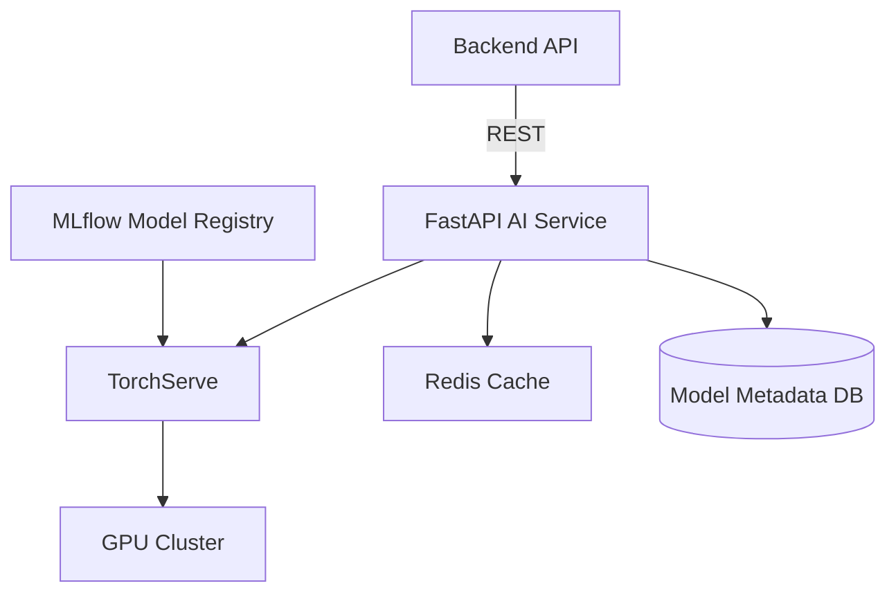

# AI Modules Architecture

**Last Updated**: 2026-01-10

## Table of Contents

1. [Overview](#overview)
2. [Microservice Architecture](#microservice-architecture)
3. [ML Models](#ml-models)
4. [Model Serving](#model-serving)
5. [Training Pipeline](#training-pipeline)
6. [Data Preprocessing](#data-preprocessing)
7. [GPU Utilization](#gpu-utilization)
8. [Inference Optimization](#inference-optimization)
9. [Monitoring & Observability](#monitoring--observability)
10. [Best Practices](#best-practices)

## Overview

The KitchenXpert AI modules are built as a separate FastAPI microservice,
providing intelligent design generation, appliance recommendations, and
compatibility checking. The system employs state-of-the-art machine learning
models with production-grade serving infrastructure.



## Microservice Architecture

FastAPI-based asynchronous microservice:

```
ai-service/
├── app/
│   ├── main.py                  # FastAPI application
│   ├── config.py                # Configuration
│   ├── api/
│   │   ├── v1/
│   │   │   ├── design.py        # Design generation endpoints
│   │   │   ├── recommendations.py # Recommendation endpoints
│   │   │   └── compatibility.py  # Compatibility check endpoints
│   │   └── dependencies.py      # Dependency injection
│   ├── models/
│   │   ├── design_generator.py  # Design generation model
│   │   ├── recommender.py       # Recommendation model
│   │   └── compatibility.py     # Compatibility model
│   ├── services/
│   │   ├── inference.py         # Inference orchestration
│   │   ├── preprocessing.py     # Data preprocessing
│   │   └── postprocessing.py    # Results postprocessing
│   ├── schemas/
│   │   ├── design.py            # Pydantic schemas
│   │   ├── recommendation.py
│   │   └── compatibility.py
│   ├── core/
│   │   ├── gpu_manager.py       # GPU allocation
│   │   ├── batch_processor.py   # Request batching
│   │   └── cache.py             # Caching layer
│   └── utils/
│       ├── metrics.py           # Prometheus metrics
│       └── logging.py           # Structured logging
├── training/
│   ├── pipelines/
│   │   ├── design_training.py
│   │   ├── recommender_training.py
│   │   └── data_collection.py
│   ├── datasets/
│   └── experiments/
├── models/                      # Saved model artifacts
├── data/
│   ├── raw/
│   ├── processed/
│   └── features/
├── tests/
├── Dockerfile
└── requirements.txt
```

### FastAPI Application

```python
# app/main.py
from fastapi import FastAPI, HTTPException, BackgroundTasks
from fastapi.middleware.cors import CORSMiddleware
from fastapi.middleware.gzip import GZipMiddleware
from prometheus_fastapi_instrumentator import Instrumentator
import uvicorn
import logging

from app.api.v1 import design, recommendations, compatibility
from app.core.gpu_manager import GPUManager
from app.config import settings

# Configure logging
logging.basicConfig(
    level=logging.INFO,
    format='%(asctime)s - %(name)s - %(levelname)s - %(message)s'
)
logger = logging.getLogger(__name__)

# Initialize FastAPI app
app = FastAPI(
    title="KitchenXpert AI Service",
    description="AI-powered kitchen design and recommendation engine",
    version="1.0.0",
    docs_url="/api/docs",
    redoc_url="/api/redoc"
)

# CORS middleware
app.add_middleware(
    CORSMiddleware,
    allow_origins=settings.ALLOWED_ORIGINS,
    allow_credentials=True,
    allow_methods=["*"],
    allow_headers=["*"]
)

# Compression middleware
app.add_middleware(GZipMiddleware, minimum_size=1000)

# Prometheus metrics
Instrumentator().instrument(app).expose(app)

# Initialize GPU manager
gpu_manager = GPUManager()

@app.on_event("startup")
async def startup_event():
    """Initialize resources on startup"""
    logger.info("Starting AI service...")

    # Initialize GPU manager
    await gpu_manager.initialize()

    # Warm up models
    logger.info("Warming up models...")
    await gpu_manager.warmup_models()

    logger.info("AI service started successfully")

@app.on_event("shutdown")
async def shutdown_event():
    """Cleanup resources on shutdown"""
    logger.info("Shutting down AI service...")
    await gpu_manager.cleanup()
    logger.info("AI service shut down")

# Health check
@app.get("/health")
async def health_check():
    return {
        "status": "healthy",
        "gpu_available": gpu_manager.is_gpu_available(),
        "models_loaded": gpu_manager.get_loaded_models()
    }

# Include routers
app.include_router(design.router, prefix="/api/v1/design", tags=["design"])
app.include_router(recommendations.router, prefix="/api/v1/recommendations", tags=["recommendations"])
app.include_router(compatibility.router, prefix="/api/v1/compatibility", tags=["compatibility"])

if __name__ == "__main__":
    uvicorn.run(
        "main:app",
        host="0.0.0.0",
        port=8000,
        reload=settings.DEBUG,
        workers=settings.WORKERS,
        log_level="info"
    )
```

### Design Generation Endpoint

```python
# app/api/v1/design.py
from fastapi import APIRouter, HTTPException, Depends, BackgroundTasks
from typing import List, Optional
import logging

from app.schemas.design import DesignRequest, DesignResponse
from app.services.inference import InferenceService
from app.core.cache import cache_service
from app.utils.metrics import track_inference_time

router = APIRouter()
logger = logging.getLogger(__name__)

@router.post("/generate", response_model=DesignResponse)
@track_inference_time("design_generation")
async def generate_design(
    request: DesignRequest,
    background_tasks: BackgroundTasks,
    inference_service: InferenceService = Depends()
):
    """
    Generate kitchen design based on user requirements

    Parameters:
    - dimensions: Kitchen dimensions (width, height, depth)
    - style: Design style (modern, traditional, contemporary, rustic, industrial)
    - budget: Budget range
    - preferences: User preferences (color scheme, materials, appliances)
    - constraints: Physical constraints (door locations, windows, plumbing)

    Returns:
    - Generated design with 3D layout
    - Recommended appliances
    - Estimated cost
    - Design score
    """
    try:
        # Check cache
        cache_key = f"design:{request.get_cache_key()}"
        cached_result = await cache_service.get(cache_key)

        if cached_result:
            logger.info(f"Cache hit for design generation: {cache_key}")
            return DesignResponse(**cached_result)

        # Generate design
        logger.info(f"Generating design for request: {request.dict()}")
        result = await inference_service.generate_design(request)

        # Cache result
        background_tasks.add_task(
            cache_service.set,
            cache_key,
            result.dict(),
            ttl=3600  # 1 hour
        )

        # Log metrics
        background_tasks.add_task(
            log_design_metrics,
            request,
            result
        )

        return result

    except Exception as e:
        logger.error(f"Design generation failed: {str(e)}", exc_info=True)
        raise HTTPException(status_code=500, detail=f"Design generation failed: {str(e)}")

@router.post("/batch", response_model=List[DesignResponse])
async def generate_designs_batch(
    requests: List[DesignRequest],
    inference_service: InferenceService = Depends()
):
    """
    Batch design generation for multiple requests
    """
    try:
        results = await inference_service.generate_designs_batch(requests)
        return results
    except Exception as e:
        logger.error(f"Batch design generation failed: {str(e)}", exc_info=True)
        raise HTTPException(status_code=500, detail=str(e))

@router.post("/refine", response_model=DesignResponse)
async def refine_design(
    design_id: str,
    modifications: dict,
    inference_service: InferenceService = Depends()
):
    """
    Refine existing design with user modifications
    """
    try:
        result = await inference_service.refine_design(design_id, modifications)
        return result
    except Exception as e:
        logger.error(f"Design refinement failed: {str(e)}", exc_info=True)
        raise HTTPException(status_code=500, detail=str(e))

async def log_design_metrics(request: DesignRequest, result: DesignResponse):
    """Background task to log design generation metrics"""
    # Log to analytics database
    pass
```

## ML Models

### 1. Design Generation Model

Transformer-based architecture trained on 50,000+ kitchen designs:

```python
# app/models/design_generator.py
import torch
import torch.nn as nn
from transformers import GPT2Model, GPT2Config
import numpy as np

class KitchenDesignGenerator(nn.Module):
    """
    Transformer-based kitchen design generator

    Architecture:
    - Input: User requirements (dimensions, style, budget, preferences)
    - Encoder: Embeddings + Positional encoding
    - Transformer: GPT2-based architecture (12 layers, 768 hidden, 12 heads)
    - Decoder: Design layout + Appliance placement + Material selection
    """

    def __init__(self, config):
        super().__init__()

        self.config = config

        # Input embeddings
        self.dimension_embedding = nn.Linear(3, 128)  # width, height, depth
        self.style_embedding = nn.Embedding(10, 128)  # 10 style categories
        self.budget_embedding = nn.Linear(1, 128)
        self.preference_embedding = nn.Linear(64, 128)  # Encoded preferences

        # Transformer backbone
        transformer_config = GPT2Config(
            vocab_size=1000,
            n_positions=512,
            n_ctx=512,
            n_embd=768,
            n_layer=12,
            n_head=12,
            resid_pdrop=0.1,
            embd_pdrop=0.1,
            attn_pdrop=0.1
        )
        self.transformer = GPT2Model(transformer_config)

        # Output heads
        self.layout_head = nn.Sequential(
            nn.Linear(768, 512),
            nn.ReLU(),
            nn.Dropout(0.1),
            nn.Linear(512, 256),
            nn.ReLU(),
            nn.Linear(256, 128)  # Layout vector
        )

        self.appliance_head = nn.Sequential(
            nn.Linear(768, 512),
            nn.ReLU(),
            nn.Dropout(0.1),
            nn.Linear(512, 256),
            nn.ReLU(),
            nn.Linear(256, 64)  # Appliance placements
        )

        self.material_head = nn.Sequential(
            nn.Linear(768, 256),
            nn.ReLU(),
            nn.Linear(256, 32)  # Material selections
        )

    def forward(self, dimensions, style, budget, preferences, constraints=None):
        """
        Forward pass

        Args:
            dimensions: Tensor of shape (batch_size, 3)
            style: Tensor of shape (batch_size,)
            budget: Tensor of shape (batch_size, 1)
            preferences: Tensor of shape (batch_size, 64)
            constraints: Optional tensor of shape (batch_size, 32)

        Returns:
            layout: Tensor of shape (batch_size, 128)
            appliances: Tensor of shape (batch_size, 64)
            materials: Tensor of shape (batch_size, 32)
        """
        batch_size = dimensions.size(0)

        # Embed inputs
        dim_emb = self.dimension_embedding(dimensions)
        style_emb = self.style_embedding(style)
        budget_emb = self.budget_embedding(budget)
        pref_emb = self.preference_embedding(preferences)

        # Concatenate embeddings
        embeddings = torch.cat([dim_emb, style_emb, budget_emb, pref_emb], dim=1)
        embeddings = embeddings.view(batch_size, -1, 128)

        # Pass through transformer
        transformer_output = self.transformer(inputs_embeds=embeddings)
        hidden_states = transformer_output.last_hidden_state

        # Pool transformer output
        pooled = hidden_states.mean(dim=1)

        # Generate outputs
        layout = self.layout_head(pooled)
        appliances = self.appliance_head(pooled)
        materials = self.material_head(pooled)

        return {
            'layout': layout,
            'appliances': appliances,
            'materials': materials
        }

    def generate(self, dimensions, style, budget, preferences, num_variations=3):
        """
        Generate multiple design variations
        """
        self.eval()

        with torch.no_grad():
            variations = []

            for _ in range(num_variations):
                # Add slight randomness
                noise_scale = 0.1
                noisy_prefs = preferences + torch.randn_like(preferences) * noise_scale

                output = self.forward(dimensions, style, budget, noisy_prefs)
                variations.append(output)

        return variations
```

### 2. Appliance Recommendation Model

Hybrid collaborative filtering + content-based approach:

```python
# app/models/recommender.py
import torch
import torch.nn as nn
import numpy as np
from typing import List, Dict

class ApplianceRecommender(nn.Module):
    """
    Hybrid recommendation system combining:
    - Collaborative filtering (user-item interactions)
    - Content-based filtering (appliance features)
    - Context-aware filtering (kitchen design context)
    """

    def __init__(self, num_users, num_items, embedding_dim=128):
        super().__init__()

        # User embeddings (collaborative filtering)
        self.user_embedding = nn.Embedding(num_users, embedding_dim)

        # Item embeddings (collaborative filtering)
        self.item_embedding = nn.Embedding(num_items, embedding_dim)

        # Content features encoder
        self.content_encoder = nn.Sequential(
            nn.Linear(256, 128),  # Appliance features
            nn.ReLU(),
            nn.Dropout(0.2),
            nn.Linear(128, embedding_dim)
        )

        # Context encoder (kitchen design)
        self.context_encoder = nn.Sequential(
            nn.Linear(128, 64),  # Design features
            nn.ReLU(),
            nn.Linear(64, embedding_dim)
        )

        # Fusion layers
        self.fusion = nn.Sequential(
            nn.Linear(embedding_dim * 3, 256),
            nn.ReLU(),
            nn.Dropout(0.2),
            nn.Linear(256, 128),
            nn.ReLU(),
            nn.Linear(128, 1),
            nn.Sigmoid()
        )

    def forward(self, user_ids, item_ids, item_features, context_features):
        """
        Forward pass

        Args:
            user_ids: Tensor of shape (batch_size,)
            item_ids: Tensor of shape (batch_size,)
            item_features: Tensor of shape (batch_size, 256)
            context_features: Tensor of shape (batch_size, 128)

        Returns:
            scores: Tensor of shape (batch_size, 1)
        """
        # Collaborative filtering
        user_emb = self.user_embedding(user_ids)
        item_emb = self.item_embedding(item_ids)

        # Content-based filtering
        content_emb = self.content_encoder(item_features)

        # Context-aware filtering
        context_emb = self.context_encoder(context_features)

        # Fuse all representations
        combined = torch.cat([user_emb, item_emb + content_emb, context_emb], dim=1)

        # Predict score
        score = self.fusion(combined)

        return score

    def recommend(self, user_id, design_features, top_k=10, filter_compatible=True):
        """
        Generate top-k recommendations for a user given design context
        """
        self.eval()

        with torch.no_grad():
            # Get all item scores
            scores = []

            for item_id in range(self.item_embedding.num_embeddings):
                item_features = self.get_item_features(item_id)
                score = self.forward(
                    torch.tensor([user_id]),
                    torch.tensor([item_id]),
                    item_features.unsqueeze(0),
                    design_features.unsqueeze(0)
                )
                scores.append((item_id, score.item()))

            # Sort by score
            scores.sort(key=lambda x: x[1], reverse=True)

            # Return top-k
            return scores[:top_k]
```

### 3. Compatibility Checker

Rule-based + ML hybrid system:

```python
# app/models/compatibility.py
import torch
import torch.nn as nn
from typing import List, Dict, Tuple

class CompatibilityChecker:
    """
    Hybrid compatibility checking system:
    - Rule-based: Hard constraints (dimensions, power, plumbing)
    - ML-based: Soft constraints (aesthetics, ergonomics, efficiency)
    """

    def __init__(self, model_path=None):
        self.rules = self._load_rules()
        self.ml_model = CompatibilityNet()

        if model_path:
            self.ml_model.load_state_dict(torch.load(model_path))
            self.ml_model.eval()

    def check_compatibility(
        self,
        appliance_a: Dict,
        appliance_b: Dict,
        kitchen_context: Dict
    ) -> Tuple[bool, float, List[str]]:
        """
        Check compatibility between two appliances

        Returns:
            is_compatible: Boolean (passes all hard constraints)
            compatibility_score: Float 0-1 (ML-based soft score)
            issues: List of compatibility issues
        """
        issues = []

        # Hard constraints (rule-based)
        dimension_ok = self._check_dimensions(appliance_a, appliance_b, kitchen_context)
        if not dimension_ok:
            issues.append("Dimensional conflict")

        power_ok = self._check_power_requirements(appliance_a, appliance_b, kitchen_context)
        if not power_ok:
            issues.append("Power requirements exceed capacity")

        plumbing_ok = self._check_plumbing(appliance_a, appliance_b, kitchen_context)
        if not plumbing_ok:
            issues.append("Plumbing conflict")

        ventilation_ok = self._check_ventilation(appliance_a, appliance_b, kitchen_context)
        if not ventilation_ok:
            issues.append("Inadequate ventilation")

        is_compatible = all([dimension_ok, power_ok, plumbing_ok, ventilation_ok])

        # Soft constraints (ML-based)
        compatibility_score = self._ml_compatibility_score(
            appliance_a,
            appliance_b,
            kitchen_context
        )

        return is_compatible, compatibility_score, issues

    def _check_dimensions(self, a, b, context):
        """Check if appliances fit without overlap"""
        # Bounding box collision detection
        a_bbox = self._get_bounding_box(a)
        b_bbox = self._get_bounding_box(b)

        return not self._boxes_intersect(a_bbox, b_bbox)

    def _check_power_requirements(self, a, b, context):
        """Check if total power requirements are within capacity"""
        total_power = a.get('power_watts', 0) + b.get('power_watts', 0)
        capacity = context.get('power_capacity', 10000)  # 10kW default

        return total_power <= capacity

    def _ml_compatibility_score(self, a, b, context):
        """ML-based soft compatibility scoring"""
        # Extract features
        features = self._extract_features(a, b, context)

        # Run through model
        with torch.no_grad():
            score = self.ml_model(features)

        return score.item()

class CompatibilityNet(nn.Module):
    """Neural network for soft compatibility scoring"""

    def __init__(self, input_dim=256):
        super().__init__()

        self.network = nn.Sequential(
            nn.Linear(input_dim, 128),
            nn.ReLU(),
            nn.Dropout(0.2),
            nn.Linear(128, 64),
            nn.ReLU(),
            nn.Dropout(0.2),
            nn.Linear(64, 32),
            nn.ReLU(),
            nn.Linear(32, 1),
            nn.Sigmoid()
        )

    def forward(self, x):
        return self.network(x)
```

## Model Serving

TorchServe for production deployment:

### TorchServe Configuration

```yaml
# torchserve-config.yaml
inference_address: http://0.0.0.0:8080
management_address: http://0.0.0.0:8081
metrics_address: http://0.0.0.0:8082

number_of_netty_threads: 32
job_queue_size: 1000

model_store: /models

models:
  design_generator:
    1.0:
      defaultVersion: true
      marName: design_generator.mar
      minWorkers: 2
      maxWorkers: 8
      batchSize: 4
      maxBatchDelay: 100
      responseTimeout: 120

  appliance_recommender:
    1.0:
      defaultVersion: true
      marName: appliance_recommender.mar
      minWorkers: 2
      maxWorkers: 4
      batchSize: 16
      maxBatchDelay: 50
      responseTimeout: 60
```

### Model Archive Creation

```python
# training/export_model.py
import torch
from torch.utils.model_archiver import ModelArchiver

def export_model_to_torchserve(model, model_name, version):
    """
    Export PyTorch model to TorchServe format
    """
    # Save model state
    torch.save(model.state_dict(), f"{model_name}_state.pth")

    # Create handler
    with open(f"{model_name}_handler.py", "w") as f:
        f.write("""
from ts.torch_handler.base_handler import BaseHandler
import torch
import json

class ModelHandler(BaseHandler):
    def initialize(self, context):
        self.manifest = context.manifest
        properties = context.system_properties
        model_dir = properties.get("model_dir")

        # Load model
        self.model = KitchenDesignGenerator(config)
        self.model.load_state_dict(torch.load(f"{model_dir}/model.pth"))
        self.model.eval()

        self.device = torch.device("cuda" if torch.cuda.is_available() else "cpu")
        self.model.to(self.device)

    def preprocess(self, data):
        # Preprocess input
        return processed_data

    def inference(self, data):
        with torch.no_grad():
            predictions = self.model(data)
        return predictions

    def postprocess(self, inference_output):
        # Postprocess output
        return response
""")

    # Create model archive
    archiver = ModelArchiver(
        model_name=model_name,
        version=version,
        serialized_file=f"{model_name}_state.pth",
        handler=f"{model_name}_handler.py",
        export_path="./model_store"
    )

    archiver.create_archive()
```

### MLflow Model Registry

```python
# training/mlflow_integration.py
import mlflow
import mlflow.pytorch

# Set tracking URI
mlflow.set_tracking_uri("http://mlflow-server:5000")

def log_model_to_registry(model, model_name, metrics, params):
    """
    Log model to MLflow registry with versioning
    """
    with mlflow.start_run():
        # Log parameters
        mlflow.log_params(params)

        # Log metrics
        mlflow.log_metrics(metrics)

        # Log model
        mlflow.pytorch.log_model(
            model,
            artifact_path="model",
            registered_model_name=model_name
        )

        # Tag version
        mlflow.set_tag("stage", "production")
        mlflow.set_tag("framework", "pytorch")

def load_production_model(model_name):
    """
    Load latest production model from registry
    """
    client = mlflow.tracking.MlflowClient()

    # Get latest production version
    versions = client.get_latest_versions(
        model_name,
        stages=["Production"]
    )

    if not versions:
        raise ValueError(f"No production version found for {model_name}")

    # Load model
    model_uri = f"models:/{model_name}/Production"
    model = mlflow.pytorch.load_model(model_uri)

    return model
```

## Training Pipeline

Automated training pipeline with data versioning:

```python
# training/pipelines/design_training.py
import torch
import torch.nn as nn
import torch.optim as optim
from torch.utils.data import DataLoader
import mlflow
from pathlib import Path

class DesignGeneratorTrainer:
    """
    Training pipeline for design generation model
    """

    def __init__(self, config):
        self.config = config
        self.device = torch.device("cuda" if torch.cuda.is_available() else "cpu")

        # Initialize model
        self.model = KitchenDesignGenerator(config)
        self.model.to(self.device)

        # Optimizer
        self.optimizer = optim.AdamW(
            self.model.parameters(),
            lr=config.learning_rate,
            weight_decay=config.weight_decay
        )

        # Scheduler
        self.scheduler = optim.lr_scheduler.CosineAnnealingLR(
            self.optimizer,
            T_max=config.epochs,
            eta_min=1e-6
        )

        # Loss function
        self.criterion = nn.MSELoss()

    def train_epoch(self, train_loader):
        """Train for one epoch"""
        self.model.train()
        total_loss = 0

        for batch_idx, batch in enumerate(train_loader):
            # Move to device
            dimensions = batch['dimensions'].to(self.device)
            style = batch['style'].to(self.device)
            budget = batch['budget'].to(self.device)
            preferences = batch['preferences'].to(self.device)
            target_layout = batch['layout'].to(self.device)
            target_appliances = batch['appliances'].to(self.device)
            target_materials = batch['materials'].to(self.device)

            # Forward pass
            self.optimizer.zero_grad()
            outputs = self.model(dimensions, style, budget, preferences)

            # Compute loss
            layout_loss = self.criterion(outputs['layout'], target_layout)
            appliance_loss = self.criterion(outputs['appliances'], target_appliances)
            material_loss = self.criterion(outputs['materials'], target_materials)

            loss = layout_loss + appliance_loss + material_loss

            # Backward pass
            loss.backward()
            torch.nn.utils.clip_grad_norm_(self.model.parameters(), 1.0)
            self.optimizer.step()

            total_loss += loss.item()

            # Log batch
            if batch_idx % 100 == 0:
                print(f"Batch {batch_idx}/{len(train_loader)}, Loss: {loss.item():.4f}")

        return total_loss / len(train_loader)

    def validate(self, val_loader):
        """Validate model"""
        self.model.eval()
        total_loss = 0

        with torch.no_grad():
            for batch in val_loader:
                dimensions = batch['dimensions'].to(self.device)
                style = batch['style'].to(self.device)
                budget = batch['budget'].to(self.device)
                preferences = batch['preferences'].to(self.device)
                target_layout = batch['layout'].to(self.device)
                target_appliances = batch['appliances'].to(self.device)
                target_materials = batch['materials'].to(self.device)

                outputs = self.model(dimensions, style, budget, preferences)

                layout_loss = self.criterion(outputs['layout'], target_layout)
                appliance_loss = self.criterion(outputs['appliances'], target_appliances)
                material_loss = self.criterion(outputs['materials'], target_materials)

                loss = layout_loss + appliance_loss + material_loss
                total_loss += loss.item()

        return total_loss / len(val_loader)

    def train(self, train_loader, val_loader, epochs):
        """Full training loop"""
        best_val_loss = float('inf')

        with mlflow.start_run():
            # Log config
            mlflow.log_params(self.config.__dict__)

            for epoch in range(epochs):
                print(f"\nEpoch {epoch+1}/{epochs}")

                # Train
                train_loss = self.train_epoch(train_loader)

                # Validate
                val_loss = self.validate(val_loader)

                # Step scheduler
                self.scheduler.step()

                # Log metrics
                mlflow.log_metrics({
                    'train_loss': train_loss,
                    'val_loss': val_loss,
                    'learning_rate': self.scheduler.get_last_lr()[0]
                }, step=epoch)

                print(f"Train Loss: {train_loss:.4f}, Val Loss: {val_loss:.4f}")

                # Save best model
                if val_loss < best_val_loss:
                    best_val_loss = val_loss
                    self.save_checkpoint(f"best_model.pth")
                    print(f"New best model saved (val_loss: {val_loss:.4f})")

            # Log final model
            mlflow.pytorch.log_model(self.model, "model")

    def save_checkpoint(self, path):
        """Save model checkpoint"""
        torch.save({
            'model_state_dict': self.model.state_dict(),
            'optimizer_state_dict': self.optimizer.state_dict(),
            'scheduler_state_dict': self.scheduler.state_dict()
        }, path)
```

## Data Preprocessing

Feature engineering and normalization:

```python
# app/services/preprocessing.py
import numpy as np
from sklearn.preprocessing import StandardScaler
from typing import Dict, List
import torch

class DataPreprocessor:
    """
    Data preprocessing for AI models
    """

    def __init__(self):
        self.scalers = {
            'dimensions': StandardScaler(),
            'budget': StandardScaler(),
            'features': StandardScaler()
        }

    def preprocess_design_request(self, request: Dict) -> Dict[str, torch.Tensor]:
        """
        Preprocess design generation request
        """
        # Normalize dimensions
        dimensions = np.array([
            request['dimensions']['width'],
            request['dimensions']['height'],
            request['dimensions']['depth']
        ]).reshape(1, -1)

        dimensions_normalized = self.scalers['dimensions'].transform(dimensions)

        # Encode style (one-hot)
        style_map = {
            'modern': 0,
            'traditional': 1,
            'contemporary': 2,
            'rustic': 3,
            'industrial': 4
        }
        style = style_map.get(request['style'], 0)

        # Normalize budget
        budget = np.array([[request['budget']]]).reshape(1, -1)
        budget_normalized = self.scalers['budget'].transform(budget)

        # Encode preferences
        preferences = self._encode_preferences(request.get('preferences', {}))

        # Convert to tensors
        return {
            'dimensions': torch.FloatTensor(dimensions_normalized),
            'style': torch.LongTensor([style]),
            'budget': torch.FloatTensor(budget_normalized),
            'preferences': torch.FloatTensor(preferences)
        }

    def _encode_preferences(self, preferences: Dict) -> np.ndarray:
        """
        Encode user preferences as feature vector
        """
        # Initialize feature vector
        features = np.zeros(64)

        # Color scheme (first 10 dimensions)
        color_map = {
            'white': 0, 'black': 1, 'gray': 2, 'brown': 3,
            'blue': 4, 'green': 5, 'red': 6, 'yellow': 7
        }
        if 'colors' in preferences:
            for color in preferences['colors']:
                idx = color_map.get(color)
                if idx is not None:
                    features[idx] = 1.0

        # Materials (next 10 dimensions)
        material_map = {
            'wood': 10, 'metal': 11, 'granite': 12, 'marble': 13,
            'quartz': 14, 'laminate': 15, 'glass': 16, 'concrete': 17
        }
        if 'materials' in preferences:
            for material in preferences['materials']:
                idx = material_map.get(material)
                if idx is not None:
                    features[idx] = 1.0

        # Appliance preferences (remaining dimensions)
        if 'appliances' in preferences:
            for i, appliance in enumerate(preferences['appliances'][:44]):
                features[20 + i] = 1.0

        return features.reshape(1, -1)

    def augment_training_data(self, data: Dict) -> List[Dict]:
        """
        Data augmentation for training
        """
        augmented = [data]

        # Rotation augmentation (for layout)
        for angle in [90, 180, 270]:
            rotated = self._rotate_layout(data, angle)
            augmented.append(rotated)

        # Scaling augmentation
        for scale in [0.9, 1.1]:
            scaled = self._scale_layout(data, scale)
            augmented.append(scaled)

        return augmented
```

## GPU Utilization

CUDA support with automatic CPU fallback:

```python
# app/core/gpu_manager.py
import torch
import logging
from typing import Optional, List

logger = logging.getLogger(__name__)

class GPUManager:
    """
    GPU resource management with automatic fallback
    """

    def __init__(self):
        self.device = self._get_device()
        self.models = {}

    def _get_device(self) -> torch.device:
        """Detect available device"""
        if torch.cuda.is_available():
            device = torch.device("cuda")
            logger.info(f"CUDA available: {torch.cuda.get_device_name(0)}")
            logger.info(f"CUDA version: {torch.version.cuda}")
            logger.info(f"GPU memory: {torch.cuda.get_device_properties(0).total_memory / 1e9:.2f} GB")
        else:
            device = torch.device("cpu")
            logger.warning("CUDA not available, using CPU")

        return device

    def is_gpu_available(self) -> bool:
        """Check if GPU is available"""
        return self.device.type == "cuda"

    async def initialize(self):
        """Initialize GPU resources"""
        if self.is_gpu_available():
            # Set memory growth
            torch.cuda.empty_cache()

            # Set cudNN benchmarking
            torch.backends.cudnn.benchmark = True

            logger.info("GPU resources initialized")

    def load_model(self, model_name: str, model: torch.nn.Module):
        """Load model to GPU/CPU"""
        model = model.to(self.device)
        model.eval()

        self.models[model_name] = model
        logger.info(f"Model {model_name} loaded to {self.device}")

    def get_memory_usage(self) -> Optional[Dict]:
        """Get GPU memory usage"""
        if not self.is_gpu_available():
            return None

        return {
            'allocated': torch.cuda.memory_allocated() / 1e9,
            'reserved': torch.cuda.memory_reserved() / 1e9,
            'max_allocated': torch.cuda.max_memory_allocated() / 1e9
        }

    async def cleanup(self):
        """Cleanup GPU resources"""
        if self.is_gpu_available():
            torch.cuda.empty_cache()
            logger.info("GPU cache cleared")

    async def warmup_models(self):
        """Warm up models with dummy inputs"""
        logger.info("Warming up models...")

        for model_name, model in self.models.items():
            try:
                # Create dummy input
                dummy_input = self._create_dummy_input(model_name)

                # Run forward pass
                with torch.no_grad():
                    _ = model(**dummy_input)

                logger.info(f"Model {model_name} warmed up")
            except Exception as e:
                logger.error(f"Failed to warm up {model_name}: {e}")
```

## Inference Optimization

Request batching and model quantization:

```python
# app/core/batch_processor.py
import asyncio
from typing import List, Dict
import torch

class BatchProcessor:
    """
    Request batching for efficient GPU utilization
    """

    def __init__(self, max_batch_size=16, max_wait_ms=50):
        self.max_batch_size = max_batch_size
        self.max_wait_ms = max_wait_ms
        self.queue = asyncio.Queue()
        self.processing = False

    async def process_request(self, request: Dict):
        """
        Add request to batch queue
        """
        future = asyncio.Future()
        await self.queue.put((request, future))

        if not self.processing:
            asyncio.create_task(self._process_batch())

        return await future

    async def _process_batch(self):
        """
        Process accumulated requests as a batch
        """
        self.processing = True

        try:
            # Wait for batch to accumulate or timeout
            batch = []
            futures = []

            start_time = asyncio.get_event_loop().time()

            while len(batch) < self.max_batch_size:
                timeout = (self.max_wait_ms / 1000) - (asyncio.get_event_loop().time() - start_time)

                if timeout <= 0:
                    break

                try:
                    request, future = await asyncio.wait_for(
                        self.queue.get(),
                        timeout=timeout
                    )
                    batch.append(request)
                    futures.append(future)
                except asyncio.TimeoutError:
                    break

            if batch:
                # Process batch
                results = await self._run_inference_batch(batch)

                # Return results to futures
                for future, result in zip(futures, results):
                    future.set_result(result)

        finally:
            self.processing = False

    async def _run_inference_batch(self, batch: List[Dict]):
        """
        Run inference on batch
        """
        # Collate batch
        batch_tensors = self._collate_batch(batch)

        # Run inference
        with torch.no_grad():
            outputs = await self.model(**batch_tensors)

        # Split outputs
        return self._split_batch_outputs(outputs, len(batch))
```

### Model Quantization

```python
# training/quantization.py
import torch
from torch.quantization import quantize_dynamic

def quantize_model(model, quantization_type='dynamic'):
    """
    Quantize model for faster inference

    Types:
    - dynamic: INT8 quantization (fastest, slight accuracy loss)
    - static: Full INT8 quantization (requires calibration)
    """
    if quantization_type == 'dynamic':
        quantized_model = quantize_dynamic(
            model,
            {torch.nn.Linear},
            dtype=torch.qint8
        )
    else:
        # Static quantization requires calibration
        pass

    return quantized_model
```

## Monitoring & Observability

Prometheus metrics for performance tracking:

```python
# app/utils/metrics.py
from prometheus_client import Counter, Histogram, Gauge
import time
from functools import wraps

# Metrics
inference_requests = Counter(
    'ai_inference_requests_total',
    'Total inference requests',
    ['model', 'status']
)

inference_duration = Histogram(
    'ai_inference_duration_seconds',
    'Inference duration in seconds',
    ['model'],
    buckets=[0.1, 0.5, 1.0, 2.0, 5.0, 10.0]
)

model_accuracy = Gauge(
    'ai_model_accuracy',
    'Model accuracy score',
    ['model']
)

gpu_memory_usage = Gauge(
    'ai_gpu_memory_bytes',
    'GPU memory usage in bytes'
)

def track_inference_time(model_name):
    """Decorator to track inference time"""
    def decorator(func):
        @wraps(func)
        async def wrapper(*args, **kwargs):
            start_time = time.time()

            try:
                result = await func(*args, **kwargs)
                inference_requests.labels(model=model_name, status='success').inc()
                return result
            except Exception as e:
                inference_requests.labels(model=model_name, status='error').inc()
                raise
            finally:
                duration = time.time() - start_time
                inference_duration.labels(model=model_name).observe(duration)

        return wrapper
    return decorator
```

## Best Practices

1. **Model Versioning**: Use MLflow for tracking experiments and model versions
2. **GPU Management**: Implement proper memory management to avoid OOM errors
3. **Batching**: Use request batching to maximize GPU utilization
4. **Caching**: Cache frequent requests to reduce inference load
5. **Monitoring**: Track inference time, accuracy, and resource usage
6. **A/B Testing**: Deploy multiple model versions and compare performance
7. **Graceful Degradation**: Fall back to CPU if GPU unavailable
8. **Input Validation**: Always validate and sanitize inputs before inference
9. **Error Handling**: Implement proper error handling and logging
10. **Testing**: Unit test preprocessing, integration test full pipeline

## Related Documentation

- [Backend Architecture](./backend.md)
- [Frontend Architecture](./frontend.md)
- [Data Flow Diagrams](./data-flow.md)
- [Security Architecture](./security.md)
- [Model Training Guide](../ml/training.md)
- [API Documentation](../api/ai-endpoints.md)
