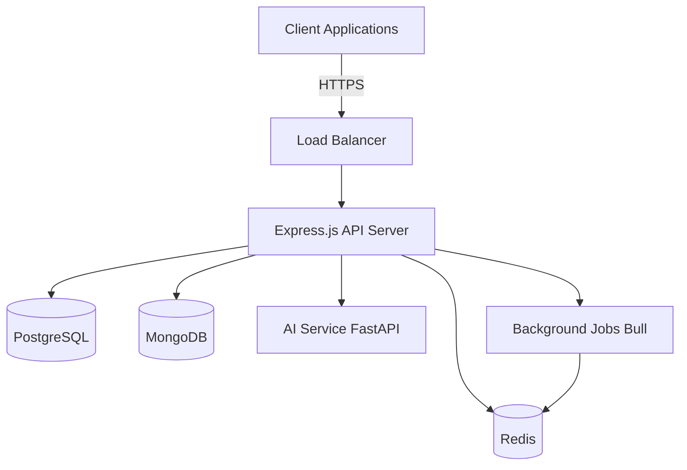

# Backend Architecture

**Last Updated**: 2026-01-10

## Table of Contents

1. [Overview](#overview)
2. [Application Structure](#application-structure)
3. [Middleware Stack](#middleware-stack)
4. [Router Organization](#router-organization)
5. [Database Layer](#database-layer)
6. [Authentication & Authorization](#authentication--authorization)
7. [API Versioning](#api-versioning)
8. [Error Handling](#error-handling)
9. [Logging Strategy](#logging-strategy)
10. [Caching Strategy](#caching-strategy)
11. [Background Jobs](#background-jobs)
12. [Best Practices](#best-practices)

## Overview

The KitchenXpert backend is built on Node.js with Express.js, following a modular, domain-driven architecture. It integrates multiple databases (PostgreSQL, MongoDB, Redis) for different use cases and employs a robust middleware stack for security, performance, and observability.



## Application Structure

The backend follows a layered architecture pattern:

```
backend/
├── src/
│   ├── config/              # Configuration files
│   │   ├── database.js      # Database connections
│   │   ├── redis.js         # Redis client
│   │   ├── security/
│   │   │   ├── csp.js       # Content Security Policy
│   │   │   └── security-headers.js
│   │   └── winston.js       # Logging configuration
│   ├── middleware/          # Express middleware
│   │   ├── auth.js          # JWT verification
│   │   ├── rateLimiter.js   # Rate limiting
│   │   ├── errorHandler.js  # Error handling
│   │   ├── requestLogger.js # Request logging
│   │   └── validation.js    # Input validation
│   ├── routes/              # API routes (modular by domain)
│   │   ├── v1/
│   │   │   ├── auth.js      # Authentication routes
│   │   │   ├── catalog.js   # Product catalog
│   │   │   ├── kitchen.js   # Kitchen designs
│   │   │   ├── ai.js        # AI endpoints
│   │   │   ├── user.js      # User management
│   │   │   └── partners.js  # Partner integrations
│   │   └── v2/              # API v2 routes
│   ├── controllers/         # Request handlers
│   ├── services/            # Business logic
│   ├── models/              # Database models
│   │   ├── postgres/        # TypeORM entities
│   │   └── mongo/           # Mongoose schemas
│   ├── repositories/        # Data access layer
│   ├── utils/               # Utility functions
│   ├── queues/              # Bull queue definitions
│   ├── validators/          # Input validation schemas
│   └── app.js               # Express app setup
├── tests/
│   ├── unit/
│   ├── integration/
│   └── e2e/
└── server.js                # Entry point
```

### Layer Responsibilities

**Controllers**: Handle HTTP requests/responses, input validation, call services
**Services**: Implement business logic, orchestrate repositories
**Repositories**: Data access abstraction, database queries
**Models**: Database schema definitions
**Middleware**: Cross-cutting concerns (auth, logging, security)

## Middleware Stack

Middleware executes in the following order:

```javascript
// src/app.js
const express = require('express');
const helmet = require('helmet');
const cors = require('cors');
const compression = require('compression');
const cookieParser = require('cookie-parser');
const { rateLimiter } = require('./middleware/rateLimiter');
const { cspMiddleware } = require('./config/security/csp');
const { requestLogger } = require('./middleware/requestLogger');
const { authMiddleware } = require('./middleware/auth');
const { errorHandler } = require('./middleware/errorHandler');

const app = express();

// 1. CORS Configuration - Must be first to handle preflight
app.use(cors({
  origin: process.env.ALLOWED_ORIGINS.split(','),
  credentials: true,
  methods: ['GET', 'POST', 'PUT', 'PATCH', 'DELETE', 'OPTIONS'],
  allowedHeaders: ['Content-Type', 'Authorization', 'X-API-Key'],
  exposedHeaders: ['X-RateLimit-Limit', 'X-RateLimit-Remaining']
}));

// 2. Helmet Security Headers
app.use(helmet({
  contentSecurityPolicy: false, // Handled separately
  hsts: {
    maxAge: 31536000,
    includeSubDomains: true,
    preload: true
  },
  frameguard: { action: 'deny' },
  noSniff: true,
  referrerPolicy: { policy: 'strict-origin-when-cross-origin' }
}));

// 3. Rate Limiter (Redis-backed)
app.use(rateLimiter.global); // Global 1000 req/hour

// 4. CSP (Content Security Policy)
app.use(cspMiddleware);

// 5. Body Parsers
app.use(express.json({ limit: '10mb' }));
app.use(express.urlencoded({ extended: true, limit: '10mb' }));

// 6. Cookie Parser
app.use(cookieParser(process.env.COOKIE_SECRET));

// 7. Compression (gzip/brotli)
app.use(compression({
  threshold: 1024, // Only compress > 1KB
  level: 6 // Balance between speed and compression
}));

// 8. Request Logging (Winston)
app.use(requestLogger);

// 9. Authentication Middleware (applied to protected routes)
// Applied selectively in routes

// 10. API Routes
app.use('/api/v1', require('./routes/v1'));
app.use('/api/v2', require('./routes/v2'));

// 11. Error Handler (must be last)
app.use(errorHandler);
```

### Middleware Details

#### 1. CORS Configuration

```javascript
// config/cors.js
module.exports = {
  development: {
    origin: ['http://localhost:3000', 'http://localhost:5173'],
    credentials: true
  },
  production: {
    origin: process.env.ALLOWED_ORIGINS.split(','),
    credentials: true,
    maxAge: 86400 // Cache preflight for 24 hours
  }
};
```

#### 2. Rate Limiter

```javascript
// middleware/rateLimiter.js
const { RateLimiterRedis } = require('rate-limiter-flexible');
const Redis = require('ioredis');

const redisClient = new Redis({
  host: process.env.REDIS_HOST,
  port: process.env.REDIS_PORT,
  enableOfflineQueue: false
});

// Global rate limiter
const globalLimiter = new RateLimiterRedis({
  storeClient: redisClient,
  keyPrefix: 'rl:global',
  points: 1000, // Requests
  duration: 3600, // Per hour
  blockDuration: 600 // Block for 10 minutes if exceeded
});

// Per-endpoint limiters
const authLimiter = new RateLimiterRedis({
  storeClient: redisClient,
  keyPrefix: 'rl:auth',
  points: 5, // 5 attempts
  duration: 60, // Per minute
  blockDuration: 900 // Block for 15 minutes
});

const apiLimiter = new RateLimiterRedis({
  storeClient: redisClient,
  keyPrefix: 'rl:api',
  points: 100,
  duration: 60,
  blockDuration: 300
});

const rateLimiterMiddleware = (limiter) => async (req, res, next) => {
  try {
    const key = req.ip;
    const rateLimiterRes = await limiter.consume(key);

    res.setHeader('X-RateLimit-Limit', limiter.points);
    res.setHeader('X-RateLimit-Remaining', rateLimiterRes.remainingPoints);
    res.setHeader('X-RateLimit-Reset', new Date(Date.now() + rateLimiterRes.msBeforeNext));

    next();
  } catch (rejRes) {
    res.status(429).json({
      error: 'Too Many Requests',
      retryAfter: Math.ceil(rejRes.msBeforeNext / 1000)
    });
  }
};

module.exports = {
  global: rateLimiterMiddleware(globalLimiter),
  auth: rateLimiterMiddleware(authLimiter),
  api: rateLimiterMiddleware(apiLimiter)
};
```

#### 3. Request Logger

```javascript
// middleware/requestLogger.js
const winston = require('../config/winston');
const { v4: uuidv4 } = require('uuid');

module.exports = (req, res, next) => {
  const requestId = uuidv4();
  req.id = requestId;

  const startTime = Date.now();

  // Log request
  winston.info('Incoming request', {
    requestId,
    method: req.method,
    url: req.url,
    ip: req.ip,
    userAgent: req.get('user-agent')
  });

  // Capture response
  const originalSend = res.send;
  res.send = function (data) {
    const duration = Date.now() - startTime;

    winston.info('Request completed', {
      requestId,
      method: req.method,
      url: req.url,
      statusCode: res.statusCode,
      duration
    });

    originalSend.call(this, data);
  };

  next();
};
```

## Router Organization

Routes are organized modularly by domain:

```javascript
// routes/v1/index.js
const express = require('express');
const router = express.Router();

const authRoutes = require('./auth');
const catalogRoutes = require('./catalog');
const kitchenRoutes = require('./kitchen');
const aiRoutes = require('./ai');
const userRoutes = require('./user');
const partnerRoutes = require('./partners');

const { authMiddleware } = require('../../middleware/auth');
const { rateLimiter } = require('../../middleware/rateLimiter');

// Public routes
router.use('/auth', rateLimiter.auth, authRoutes);
router.use('/catalog', catalogRoutes); // Public catalog browsing

// Protected routes
router.use('/kitchen', authMiddleware, kitchenRoutes);
router.use('/ai', authMiddleware, rateLimiter.api, aiRoutes);
router.use('/user', authMiddleware, userRoutes);
router.use('/partners', authMiddleware, partnerRoutes);

module.exports = router;
```

### Route Example

```javascript
// routes/v1/kitchen.js
const express = require('express');
const router = express.Router();
const { kitchenController } = require('../../controllers/kitchenController');
const { validateDesign } = require('../../validators/designValidator');
const { checkPermission } = require('../../middleware/authorization');

// Get all user's designs
router.get('/designs', kitchenController.getUserDesigns);

// Get specific design
router.get('/designs/:id', kitchenController.getDesign);

// Create new design
router.post('/designs', validateDesign, kitchenController.createDesign);

// Update design
router.put('/designs/:id',
  checkPermission('design:update'),
  validateDesign,
  kitchenController.updateDesign
);

// Delete design
router.delete('/designs/:id',
  checkPermission('design:delete'),
  kitchenController.deleteDesign
);

// Share design
router.post('/designs/:id/share', kitchenController.shareDesign);

module.exports = router;
```

## Database Layer

KitchenXpert uses a polyglot persistence approach:

### PostgreSQL (Relational Data)

**Use Cases**: Users, catalog items, orders, sessions, audit logs

```javascript
// config/database.js
const { DataSource } = require('typeorm');

const AppDataSource = new DataSource({
  type: 'postgres',
  host: process.env.POSTGRES_HOST,
  port: parseInt(process.env.POSTGRES_PORT),
  username: process.env.POSTGRES_USER,
  password: process.env.POSTGRES_PASSWORD,
  database: process.env.POSTGRES_DB,
  synchronize: false, // Never in production
  logging: process.env.NODE_ENV === 'development',
  entities: ['src/models/postgres/**/*.js'],
  migrations: ['src/migrations/**/*.js'],
  subscribers: ['src/subscribers/**/*.js'],
  ssl: process.env.NODE_ENV === 'production' ? { rejectUnauthorized: false } : false,
  poolSize: 20,
  extra: {
    max: 20,
    connectionTimeoutMillis: 5000,
    idleTimeoutMillis: 30000
  }
});

module.exports = { AppDataSource };
```

**Example Entity**:

```javascript
// models/postgres/User.js
const { EntitySchema } = require('typeorm');

module.exports = new EntitySchema({
  name: 'User',
  tableName: 'users',
  columns: {
    id: {
      type: 'uuid',
      primary: true,
      generated: 'uuid'
    },
    email: {
      type: 'varchar',
      unique: true,
      nullable: false
    },
    passwordHash: {
      type: 'varchar',
      nullable: true // Null for OAuth users
    },
    firstName: {
      type: 'varchar',
      nullable: false
    },
    lastName: {
      type: 'varchar',
      nullable: false
    },
    role: {
      type: 'enum',
      enum: ['customer', 'partner', 'admin'],
      default: 'customer'
    },
    emailVerified: {
      type: 'boolean',
      default: false
    },
    createdAt: {
      type: 'timestamp',
      createDate: true
    },
    updatedAt: {
      type: 'timestamp',
      updateDate: true
    }
  },
  indices: [
    { columns: ['email'] },
    { columns: ['role'] }
  ]
});
```

### MongoDB (Document Data)

**Use Cases**: Designs, AI suggestions, catalog cache, analytics events

```javascript
// config/mongodb.js
const mongoose = require('mongoose');

const connectMongoDB = async () => {
  try {
    await mongoose.connect(process.env.MONGODB_URI, {
      maxPoolSize: 10,
      serverSelectionTimeoutMS: 5000,
      socketTimeoutMS: 45000,
      family: 4
    });

    console.log('MongoDB connected successfully');
  } catch (error) {
    console.error('MongoDB connection error:', error);
    process.exit(1);
  }
};

module.exports = { connectMongoDB };
```

**Example Schema**:

```javascript
// models/mongo/Design.js
const mongoose = require('mongoose');

const designSchema = new mongoose.Schema({
  userId: {
    type: String,
    required: true,
    index: true
  },
  name: {
    type: String,
    required: true
  },
  description: String,
  dimensions: {
    width: Number,
    height: Number,
    depth: Number
  },
  layout: {
    walls: [Object],
    appliances: [Object],
    cabinets: [Object],
    countertops: [Object]
  },
  style: {
    type: String,
    enum: ['modern', 'traditional', 'contemporary', 'rustic', 'industrial']
  },
  aiGenerated: {
    type: Boolean,
    default: false
  },
  aiSuggestionId: String,
  thumbnail: String,
  tags: [String],
  shared: {
    type: Boolean,
    default: false
  },
  shareToken: String,
  version: {
    type: Number,
    default: 1
  }
}, {
  timestamps: true,
  collection: 'designs'
});

designSchema.index({ userId: 1, createdAt: -1 });
designSchema.index({ tags: 1 });
designSchema.index({ shareToken: 1 }, { sparse: true });

module.exports = mongoose.model('Design', designSchema);
```

### Redis (Caching & Sessions)

**Use Cases**: Sessions, cache, Bull queues

```javascript
// config/redis.js
const Redis = require('ioredis');

const redisClient = new Redis({
  host: process.env.REDIS_HOST || 'localhost',
  port: process.env.REDIS_PORT || 6379,
  password: process.env.REDIS_PASSWORD,
  db: 0,
  retryStrategy: (times) => {
    const delay = Math.min(times * 50, 2000);
    return delay;
  },
  maxRetriesPerRequest: 3
});

redisClient.on('connect', () => {
  console.log('Redis connected');
});

redisClient.on('error', (err) => {
  console.error('Redis error:', err);
});

module.exports = redisClient;
```

## Authentication & Authorization

### JWT-Based Authentication

```javascript
// services/authService.js
const jwt = require('jsonwebtoken');
const bcrypt = require('bcrypt');
const { AppDataSource } = require('../config/database');

class AuthService {
  async login(email, password) {
    const userRepo = AppDataSource.getRepository('User');
    const user = await userRepo.findOne({ where: { email } });

    if (!user || !user.passwordHash) {
      throw new Error('Invalid credentials');
    }

    const isValid = await bcrypt.compare(password, user.passwordHash);
    if (!isValid) {
      throw new Error('Invalid credentials');
    }

    const accessToken = this.generateAccessToken(user);
    const refreshToken = this.generateRefreshToken(user);

    // Store refresh token in Redis
    await redisClient.setex(
      `refresh:${user.id}`,
      7 * 24 * 60 * 60, // 7 days
      refreshToken
    );

    return { accessToken, refreshToken, user };
  }

  generateAccessToken(user) {
    return jwt.sign(
      {
        id: user.id,
        email: user.email,
        role: user.role
      },
      process.env.JWT_SECRET,
      { expiresIn: '15m' }
    );
  }

  generateRefreshToken(user) {
    return jwt.sign(
      { id: user.id },
      process.env.JWT_REFRESH_SECRET,
      { expiresIn: '7d' }
    );
  }

  async refreshAccessToken(refreshToken) {
    try {
      const decoded = jwt.verify(refreshToken, process.env.JWT_REFRESH_SECRET);

      // Verify refresh token exists in Redis
      const storedToken = await redisClient.get(`refresh:${decoded.id}`);
      if (storedToken !== refreshToken) {
        throw new Error('Invalid refresh token');
      }

      const userRepo = AppDataSource.getRepository('User');
      const user = await userRepo.findOne({ where: { id: decoded.id } });

      if (!user) {
        throw new Error('User not found');
      }

      return this.generateAccessToken(user);
    } catch (error) {
      throw new Error('Invalid refresh token');
    }
  }
}

module.exports = new AuthService();
```

### OAuth2 Integration

```javascript
// services/oauth/googleOAuth.js
const { OAuth2Client } = require('google-auth-library');
const client = new OAuth2Client(process.env.GOOGLE_CLIENT_ID);

async function verifyGoogleToken(token) {
  const ticket = await client.verifyIdToken({
    idToken: token,
    audience: process.env.GOOGLE_CLIENT_ID
  });

  const payload = ticket.getPayload();
  return {
    email: payload.email,
    firstName: payload.given_name,
    lastName: payload.family_name,
    emailVerified: payload.email_verified,
    provider: 'google',
    providerId: payload.sub
  };
}

module.exports = { verifyGoogleToken };
```

### RBAC (Role-Based Access Control)

```javascript
// middleware/authorization.js
const permissions = {
  customer: [
    'design:read:own',
    'design:create',
    'design:update:own',
    'design:delete:own',
    'catalog:read',
    'order:create:own',
    'order:read:own'
  ],
  partner: [
    'design:read:own',
    'design:create',
    'design:update:own',
    'design:delete:own',
    'catalog:read',
    'catalog:create',
    'catalog:update:own',
    'catalog:delete:own',
    'partner:read:own',
    'partner:update:own'
  ],
  admin: [
    'design:read:all',
    'design:update:all',
    'design:delete:all',
    'catalog:read',
    'catalog:create',
    'catalog:update:all',
    'catalog:delete:all',
    'user:read:all',
    'user:update:all',
    'user:delete:all',
    'partner:read:all',
    'partner:update:all',
    'partner:delete:all'
  ]
};

const checkPermission = (requiredPermission) => {
  return (req, res, next) => {
    const userRole = req.user.role;
    const userPermissions = permissions[userRole] || [];

    // Check exact permission or wildcard
    const hasPermission = userPermissions.some(perm => {
      if (perm === requiredPermission) return true;
      if (perm.endsWith(':all') && requiredPermission.startsWith(perm.split(':')[0])) return true;
      return false;
    });

    if (!hasPermission) {
      return res.status(403).json({ error: 'Forbidden' });
    }

    next();
  };
};

module.exports = { checkPermission };
```

## API Versioning

URL-based versioning strategy:

```javascript
// routes/index.js
app.use('/api/v1', require('./v1'));
app.use('/api/v2', require('./v2'));

// Version deprecation middleware
app.use('/api/v1', (req, res, next) => {
  res.setHeader('X-API-Deprecated', 'false');
  res.setHeader('X-API-Version', 'v1');
  next();
});

app.use('/api/v2', (req, res, next) => {
  res.setHeader('X-API-Version', 'v2');
  next();
});
```

## Error Handling

Centralized error handling with custom error classes:

```javascript
// middleware/errorHandler.js
const winston = require('../config/winston');

class AppError extends Error {
  constructor(message, statusCode, isOperational = true) {
    super(message);
    this.statusCode = statusCode;
    this.isOperational = isOperational;
    Error.captureStackTrace(this, this.constructor);
  }
}

class ValidationError extends AppError {
  constructor(message) {
    super(message, 400);
  }
}

class UnauthorizedError extends AppError {
  constructor(message = 'Unauthorized') {
    super(message, 401);
  }
}

class ForbiddenError extends AppError {
  constructor(message = 'Forbidden') {
    super(message, 403);
  }
}

class NotFoundError extends AppError {
  constructor(message = 'Resource not found') {
    super(message, 404);
  }
}

const errorHandler = (err, req, res, next) => {
  let { statusCode = 500, message } = err;

  // Log error
  winston.error('Error occurred', {
    requestId: req.id,
    error: {
      message: err.message,
      stack: err.stack,
      statusCode
    },
    request: {
      method: req.method,
      url: req.url,
      ip: req.ip
    }
  });

  // Don't leak error details in production
  if (process.env.NODE_ENV === 'production' && !err.isOperational) {
    message = 'Internal server error';
  }

  res.status(statusCode).json({
    error: {
      message,
      statusCode,
      ...(process.env.NODE_ENV === 'development' && { stack: err.stack })
    }
  });
};

module.exports = {
  AppError,
  ValidationError,
  UnauthorizedError,
  ForbiddenError,
  NotFoundError,
  errorHandler
};
```

## Logging Strategy

Winston-based logging with multiple transports:

```javascript
// config/winston.js
const winston = require('winston');
const { ElasticsearchTransport } = require('winston-elasticsearch');

const logFormat = winston.format.combine(
  winston.format.timestamp({ format: 'YYYY-MM-DD HH:mm:ss' }),
  winston.format.errors({ stack: true }),
  winston.format.splat(),
  winston.format.json()
);

const transports = [
  // Console transport
  new winston.transports.Console({
    format: winston.format.combine(
      winston.format.colorize(),
      winston.format.printf(({ timestamp, level, message, ...meta }) => {
        return `${timestamp} [${level}]: ${message} ${Object.keys(meta).length ? JSON.stringify(meta) : ''}`;
      })
    )
  }),

  // File transports
  new winston.transports.File({
    filename: 'logs/error.log',
    level: 'error',
    maxsize: 10485760, // 10MB
    maxFiles: 10
  }),
  new winston.transports.File({
    filename: 'logs/combined.log',
    maxsize: 10485760,
    maxFiles: 10
  })
];

// Add Elasticsearch in production
if (process.env.NODE_ENV === 'production') {
  transports.push(
    new ElasticsearchTransport({
      level: 'info',
      clientOpts: {
        node: process.env.ELASTICSEARCH_URL,
        auth: {
          username: process.env.ELASTICSEARCH_USER,
          password: process.env.ELASTICSEARCH_PASSWORD
        }
      },
      index: 'kitchenxpert-logs'
    })
  );
}

const logger = winston.createLogger({
  level: process.env.LOG_LEVEL || 'info',
  format: logFormat,
  transports,
  exitOnError: false
});

module.exports = logger;
```

## Caching Strategy

Redis-based caching with TTL and invalidation patterns:

```javascript
// services/cacheService.js
const redisClient = require('../config/redis');

class CacheService {
  async get(key) {
    try {
      const data = await redisClient.get(key);
      return data ? JSON.parse(data) : null;
    } catch (error) {
      console.error('Cache get error:', error);
      return null;
    }
  }

  async set(key, value, ttl = 3600) {
    try {
      await redisClient.setex(key, ttl, JSON.stringify(value));
    } catch (error) {
      console.error('Cache set error:', error);
    }
  }

  async del(key) {
    try {
      await redisClient.del(key);
    } catch (error) {
      console.error('Cache delete error:', error);
    }
  }

  async invalidatePattern(pattern) {
    try {
      const keys = await redisClient.keys(pattern);
      if (keys.length > 0) {
        await redisClient.del(...keys);
      }
    } catch (error) {
      console.error('Cache invalidation error:', error);
    }
  }

  // Cache-aside pattern wrapper
  async wrap(key, fn, ttl = 3600) {
    let data = await this.get(key);

    if (data === null) {
      data = await fn();
      await this.set(key, data, ttl);
    }

    return data;
  }
}

module.exports = new CacheService();
```

**Caching Patterns**:

```javascript
// Example: Catalog item caching
router.get('/catalog/items/:id', async (req, res) => {
  const cacheKey = `catalog:item:${req.params.id}`;

  const item = await cacheService.wrap(
    cacheKey,
    async () => {
      return await catalogService.getItem(req.params.id);
    },
    1800 // 30 minutes
  );

  res.json(item);
});

// Invalidation on update
router.put('/catalog/items/:id', async (req, res) => {
  const item = await catalogService.updateItem(req.params.id, req.body);

  // Invalidate specific item cache
  await cacheService.del(`catalog:item:${req.params.id}`);

  // Invalidate list caches
  await cacheService.invalidatePattern('catalog:items:*');

  res.json(item);
});
```

## Background Jobs

Bull queues for asynchronous processing:

```javascript
// queues/index.js
const Queue = require('bull');
const redisConfig = {
  redis: {
    host: process.env.REDIS_HOST,
    port: process.env.REDIS_PORT,
    password: process.env.REDIS_PASSWORD
  }
};

// Queue definitions
const emailQueue = new Queue('email', redisConfig);
const webhookQueue = new Queue('webhook', redisConfig);
const aiProcessingQueue = new Queue('ai-processing', redisConfig);
const catalogSyncQueue = new Queue('catalog-sync', redisConfig);

// Email queue processor
emailQueue.process(async (job) => {
  const { to, subject, template, data } = job.data;
  await emailService.send(to, subject, template, data);
});

// Webhook queue processor with retry
webhookQueue.process(async (job) => {
  const { url, payload, headers } = job.data;

  try {
    await axios.post(url, payload, { headers, timeout: 10000 });
  } catch (error) {
    if (job.attemptsMade < 3) {
      throw error; // Retry
    }
    // Log failed webhook
    await webhookService.logFailure(job.data, error);
  }
});

// AI processing queue
aiProcessingQueue.process(5, async (job) => { // 5 concurrent jobs
  const { userId, designId, params } = job.data;

  const result = await aiService.generateDesign(params);

  await designService.updateAIResult(designId, result);

  // Notify user via WebSocket
  await notificationService.notify(userId, 'design-ready', { designId });

  return result;
});

module.exports = {
  emailQueue,
  webhookQueue,
  aiProcessingQueue,
  catalogSyncQueue
};
```

**Queue Configuration**:

```javascript
// Job options
const jobOptions = {
  attempts: 3,
  backoff: {
    type: 'exponential',
    delay: 2000
  },
  removeOnComplete: true,
  removeOnFail: false
};

// Add job
await emailQueue.add({
  to: 'user@example.com',
  subject: 'Welcome to KitchenXpert',
  template: 'welcome',
  data: { name: 'John' }
}, jobOptions);
```

## Best Practices

1. **Error Handling**: Always use custom error classes for better error categorization
2. **Validation**: Validate all inputs at the route level using validation middleware
3. **Database Queries**: Use repository pattern for abstraction and testability
4. **Caching**: Implement cache-aside pattern with proper invalidation
5. **Logging**: Include request IDs for tracing requests across services
6. **Security**: Never trust user input, always sanitize and validate
7. **Performance**: Use database indexes, connection pooling, and query optimization
8. **Testing**: Write unit tests for services, integration tests for routes
9. **Documentation**: Keep API documentation up-to-date with OpenAPI/Swagger
10. **Monitoring**: Track performance metrics, error rates, and resource usage

## Related Documentation

- [Frontend Architecture](./frontend.md)
- [AI Modules Architecture](./ai-modules.md)
- [Data Flow Diagrams](./data-flow.md)
- [Security Architecture](./security.md)
- [API Documentation](../api/README.md)
- [Database Schemas](../database/README.md)
