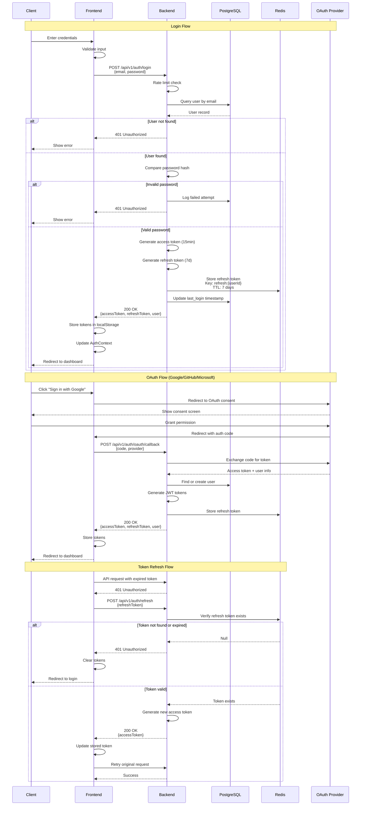
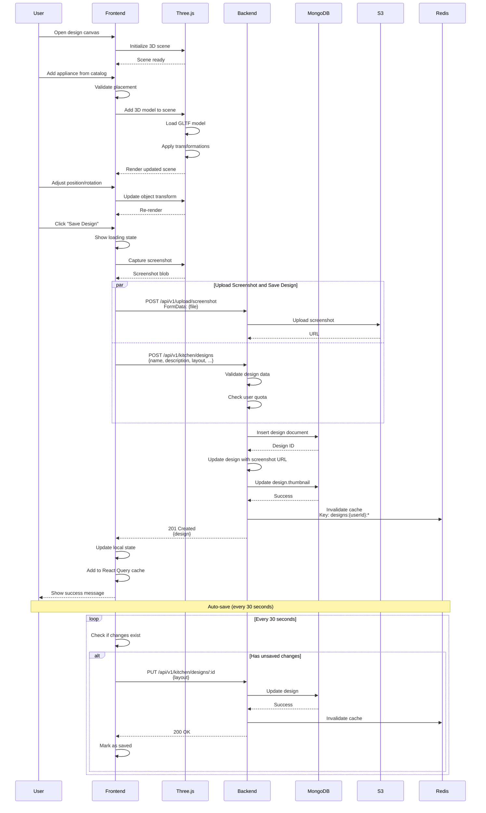
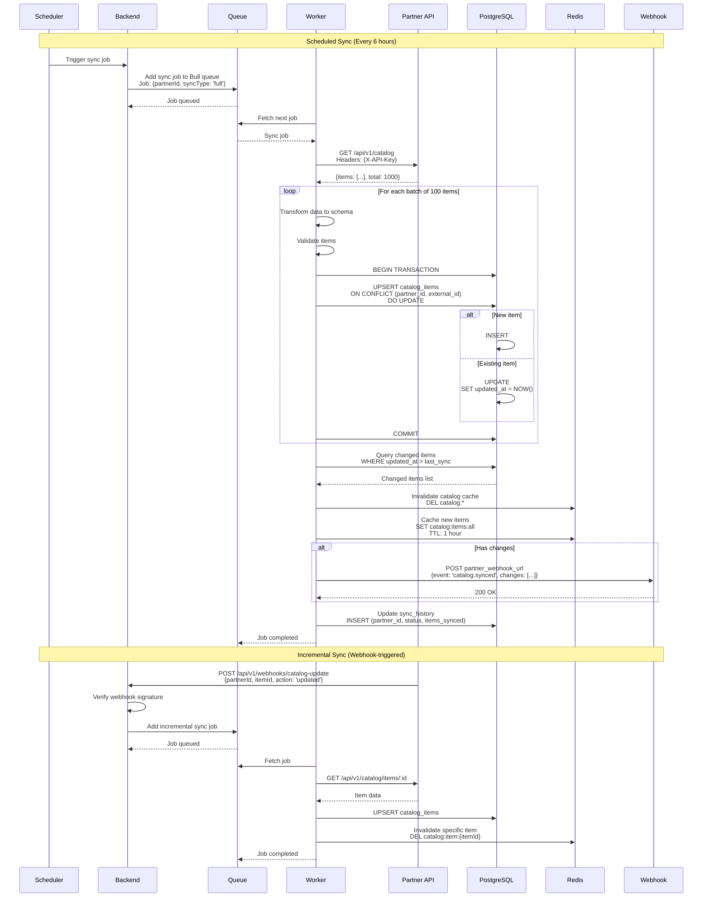
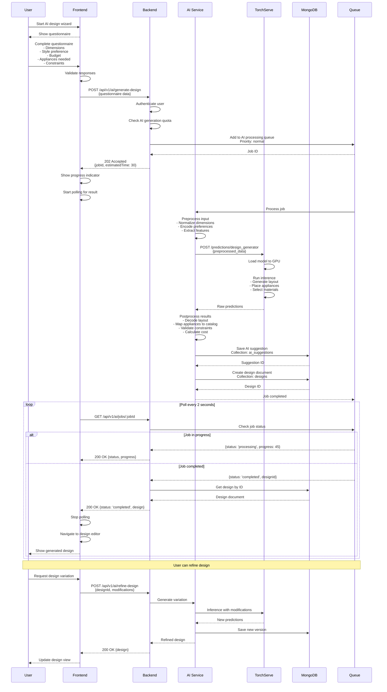
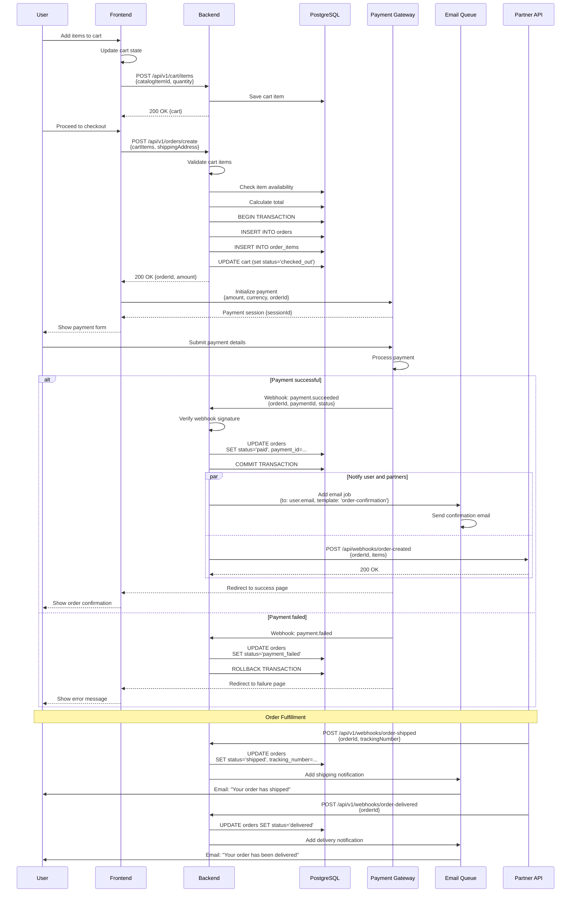
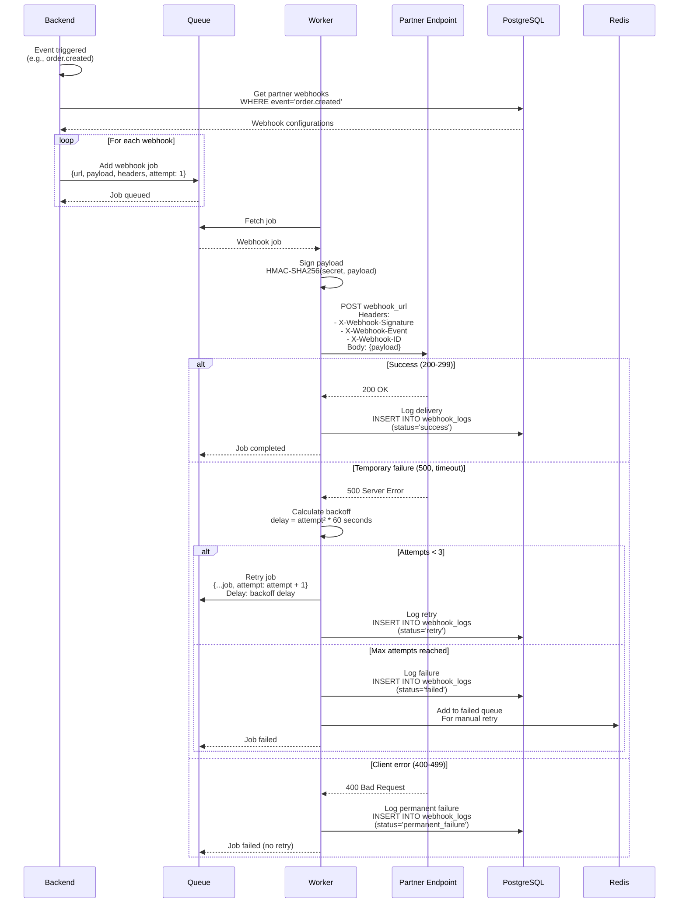
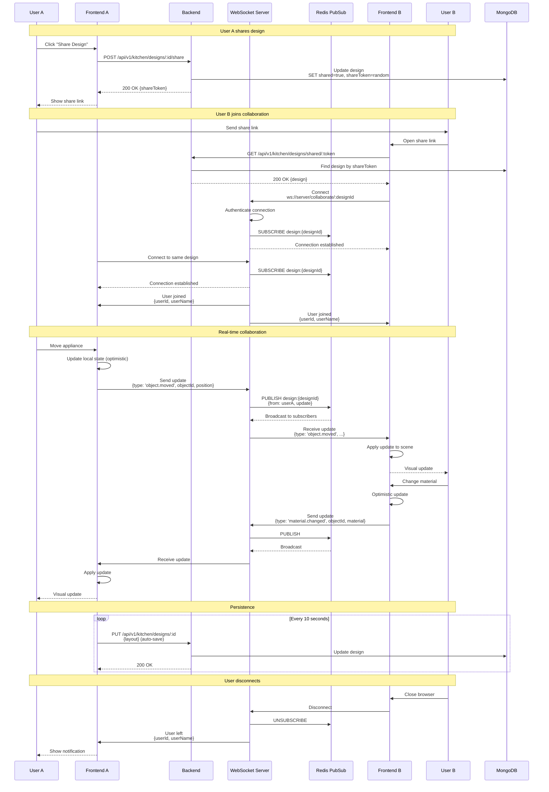
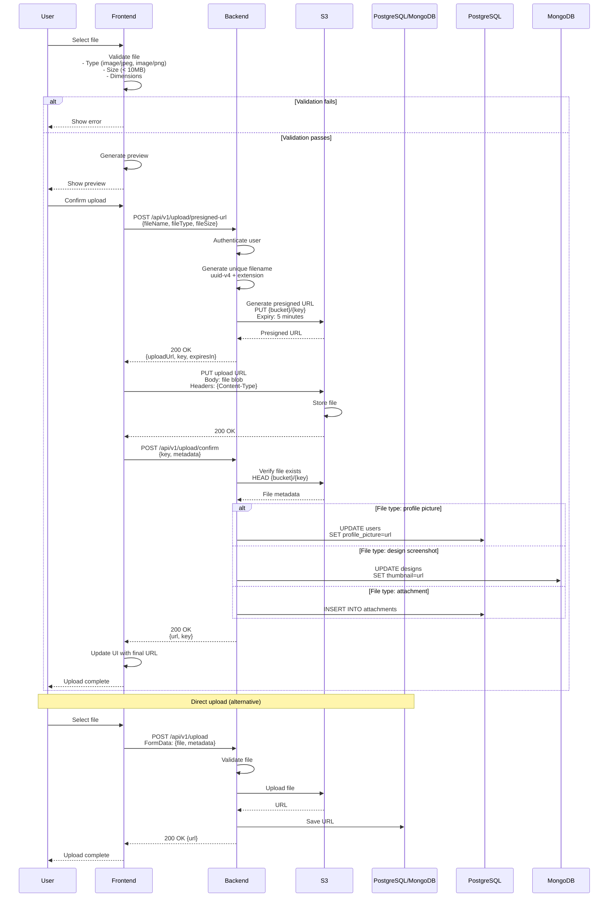

# Data Flow Architecture

**Last Updated**: 2026-01-10

## Table of Contents

1. [Overview](#overview)
2. [User Authentication Flow](#user-authentication-flow)
3. [Design Creation and Save Flow](#design-creation-and-save-flow)
4. [Catalog Synchronization Flow](#catalog-synchronization-flow)
5. [AI Design Generation Flow](#ai-design-generation-flow)
6. [Order Processing Flow](#order-processing-flow)
7. [Webhook Delivery Flow](#webhook-delivery-flow)
8. [Real-Time Collaboration Flow](#real-time-collaboration-flow)
9. [File Upload Flow](#file-upload-flow)
10. [Best Practices](#best-practices)

## Overview

This document outlines the detailed data flows for critical operations in the KitchenXpert platform. Each flow includes sequence diagrams, data transformations, error handling, and performance considerations.

## User Authentication Flow

Complete authentication flow including JWT generation and refresh:



### Authentication Flow Details

**Request Payload (Login)**:
```json
{
  "email": "user@example.com",
  "password": "SecureP@ssw0rd"
}
```

**Response Payload**:
```json
{
  "accessToken": "eyJhbGciOiJIUzI1NiIs...",
  "refreshToken": "eyJhbGciOiJIUzI1NiIs...",
  "user": {
    "id": "uuid-v4",
    "email": "user@example.com",
    "firstName": "John",
    "lastName": "Doe",
    "role": "customer",
    "emailVerified": true
  }
}
```

**Token Structure**:
```javascript
// Access Token (JWT)
{
  "id": "uuid-v4",
  "email": "user@example.com",
  "role": "customer",
  "iat": 1704902400,
  "exp": 1704903300  // 15 minutes
}

// Refresh Token (JWT)
{
  "id": "uuid-v4",
  "iat": 1704902400,
  "exp": 1705507200  // 7 days
}
```

## Design Creation and Save Flow

3D design creation with real-time preview and save:



### Design Data Structure

**Create Design Request**:
```json
{
  "name": "Modern Kitchen Design",
  "description": "Contemporary kitchen with island",
  "dimensions": {
    "width": 5.5,
    "height": 2.8,
    "depth": 4.0
  },
  "layout": {
    "walls": [
      {
        "id": "wall-1",
        "start": { "x": 0, "y": 0, "z": 0 },
        "end": { "x": 5.5, "y": 0, "z": 0 },
        "height": 2.8,
        "material": "painted-drywall",
        "color": "#FFFFFF"
      }
    ],
    "appliances": [
      {
        "id": "appliance-1",
        "catalogItemId": "uuid-v4",
        "type": "refrigerator",
        "position": { "x": 0.5, "y": 0, "z": 0.3 },
        "rotation": { "x": 0, "y": 0, "z": 0 },
        "modelUrl": "/models/refrigerator-model.glb"
      }
    ],
    "cabinets": [...],
    "countertops": [...]
  },
  "style": "modern",
  "tags": ["modern", "island", "white"],
  "aiGenerated": false
}
```

**MongoDB Document**:
```javascript
{
  _id: ObjectId("..."),
  userId: "uuid-v4",
  name: "Modern Kitchen Design",
  description: "Contemporary kitchen with island",
  dimensions: {
    width: 5.5,
    height: 2.8,
    depth: 4.0
  },
  layout: { /* ... */ },
  style: "modern",
  aiGenerated: false,
  thumbnail: "https://s3.amazonaws.com/kitchenxpert/designs/uuid-v4.jpg",
  tags: ["modern", "island", "white"],
  shared: false,
  shareToken: null,
  version: 1,
  createdAt: ISODate("2026-01-10T10:00:00Z"),
  updatedAt: ISODate("2026-01-10T10:00:00Z")
}
```

## Catalog Synchronization Flow

Partner API to PostgreSQL catalog sync:



### Catalog Sync Details

**Partner API Response**:
```json
{
  "items": [
    {
      "id": "partner-item-123",
      "name": "Premium Refrigerator",
      "description": "Energy-efficient side-by-side refrigerator",
      "category": "refrigerators",
      "price": 1299.99,
      "currency": "USD",
      "dimensions": {
        "width": 91.4,
        "height": 178.8,
        "depth": 88.9
      },
      "specifications": {
        "capacity": "25 cu ft",
        "energyRating": "A++",
        "color": "Stainless Steel"
      },
      "images": [
        "https://partner-cdn.com/images/item-123-1.jpg"
      ],
      "availability": "in_stock",
      "updatedAt": "2026-01-10T09:00:00Z"
    }
  ],
  "total": 1000,
  "page": 1,
  "perPage": 100
}
```

**PostgreSQL Schema**:
```sql
CREATE TABLE catalog_items (
  id UUID PRIMARY KEY DEFAULT gen_random_uuid(),
  partner_id UUID NOT NULL REFERENCES partners(id),
  external_id VARCHAR(255) NOT NULL,
  name VARCHAR(500) NOT NULL,
  description TEXT,
  category VARCHAR(100),
  price DECIMAL(10, 2),
  currency VARCHAR(3) DEFAULT 'USD',
  dimensions JSONB,
  specifications JSONB,
  images JSONB,
  availability VARCHAR(50),
  created_at TIMESTAMP DEFAULT NOW(),
  updated_at TIMESTAMP DEFAULT NOW(),
  UNIQUE(partner_id, external_id)
);

CREATE INDEX idx_catalog_category ON catalog_items(category);
CREATE INDEX idx_catalog_partner ON catalog_items(partner_id);
CREATE INDEX idx_catalog_updated ON catalog_items(updated_at);
```

## AI Design Generation Flow

Questionnaire-based AI design generation:



### AI Generation Request

**Questionnaire Payload**:
```json
{
  "dimensions": {
    "width": 5.5,
    "height": 2.8,
    "depth": 4.0,
    "shape": "rectangular"
  },
  "style": "modern",
  "budget": 15000,
  "budgetFlexibility": 0.1,
  "preferences": {
    "colors": ["white", "gray"],
    "materials": ["quartz", "metal"],
    "applianceTypes": ["refrigerator", "oven", "dishwasher", "microwave"],
    "layoutType": "l-shaped",
    "features": ["island", "breakfast-bar"]
  },
  "constraints": {
    "doorLocation": { "wall": "north", "position": 0.5 },
    "windowLocations": [
      { "wall": "east", "position": 0.3, "width": 1.5 }
    ],
    "plumbingLocation": { "wall": "west", "position": 0.7 }
  },
  "priorities": {
    "storage": 0.8,
    "workflow": 0.9,
    "aesthetics": 0.7,
    "cost": 0.6
  }
}
```

**AI Response**:
```json
{
  "designId": "uuid-v4",
  "suggestionId": "uuid-v4",
  "layout": {
    "walls": [...],
    "appliances": [...],
    "cabinets": [...],
    "countertops": [...]
  },
  "recommendations": {
    "appliances": [
      {
        "catalogItemId": "uuid-v4",
        "type": "refrigerator",
        "name": "Premium Side-by-Side",
        "price": 1299.99,
        "reasoning": "Energy-efficient, fits budget, matches modern style"
      }
    ]
  },
  "estimatedCost": {
    "appliances": 8500,
    "cabinets": 4200,
    "countertops": 1800,
    "installation": 2500,
    "total": 17000
  },
  "score": 0.87,
  "alternatives": [
    {
      "name": "Budget-Friendly Variation",
      "totalCost": 13500,
      "score": 0.81
    }
  ]
}
```

## Order Processing Flow

Cart to confirmation with payment integration:



### Order Data Structure

**Create Order Request**:
```json
{
  "cartItems": [
    {
      "catalogItemId": "uuid-v4",
      "quantity": 1,
      "price": 1299.99
    }
  ],
  "shippingAddress": {
    "firstName": "John",
    "lastName": "Doe",
    "addressLine1": "123 Main St",
    "addressLine2": "Apt 4B",
    "city": "New York",
    "state": "NY",
    "zipCode": "10001",
    "country": "US",
    "phone": "+1-555-0123"
  },
  "billingAddress": { /* same structure */ },
  "notes": "Please deliver after 5 PM"
}
```

**Order States**:
```
created → paid → processing → shipped → delivered
                      ↓
                   cancelled
```

## Webhook Delivery Flow

Event-driven webhook delivery with retry logic:



### Webhook Payload Format

**Event Payload**:
```json
{
  "id": "evt_uuid-v4",
  "event": "order.created",
  "timestamp": "2026-01-10T10:00:00Z",
  "data": {
    "orderId": "uuid-v4",
    "userId": "uuid-v4",
    "total": 1299.99,
    "currency": "USD",
    "items": [
      {
        "catalogItemId": "uuid-v4",
        "externalId": "partner-item-123",
        "quantity": 1,
        "price": 1299.99
      }
    ]
  }
}
```

**Headers**:
```
X-Webhook-Signature: sha256=abc123def456...
X-Webhook-Event: order.created
X-Webhook-ID: evt_uuid-v4
X-Webhook-Timestamp: 1704902400
Content-Type: application/json
```

## Real-Time Collaboration Flow

WebSocket-based real-time design collaboration:



### WebSocket Message Format

**Client to Server**:
```json
{
  "type": "object.moved",
  "designId": "uuid-v4",
  "objectId": "appliance-1",
  "data": {
    "position": { "x": 1.5, "y": 0, "z": 2.0 }
  },
  "timestamp": 1704902400000
}
```

**Server to Client**:
```json
{
  "type": "object.moved",
  "from": {
    "userId": "uuid-v4",
    "userName": "John Doe"
  },
  "objectId": "appliance-1",
  "data": {
    "position": { "x": 1.5, "y": 0, "z": 2.0 }
  },
  "timestamp": 1704902400000
}
```

## File Upload Flow

Frontend to S3 with database URL storage:



### Upload Configuration

**File Validation Rules**:
```javascript
{
  images: {
    allowedTypes: ['image/jpeg', 'image/png', 'image/webp'],
    maxSize: 10 * 1024 * 1024, // 10MB
    maxDimensions: { width: 4096, height: 4096 }
  },
  models: {
    allowedTypes: ['model/gltf-binary', 'model/gltf+json'],
    maxSize: 50 * 1024 * 1024 // 50MB
  },
  documents: {
    allowedTypes: ['application/pdf'],
    maxSize: 5 * 1024 * 1024 // 5MB
  }
}
```

**S3 Bucket Policy**:
```json
{
  "Version": "2012-10-17",
  "Statement": [
    {
      "Sid": "AllowPresignedUploads",
      "Effect": "Allow",
      "Principal": "*",
      "Action": "s3:PutObject",
      "Resource": "arn:aws:s3:::kitchenxpert-uploads/*",
      "Condition": {
        "StringEquals": {
          "s3:x-amz-server-side-encryption": "AES256"
        }
      }
    }
  ]
}
```

## Best Practices

1. **Error Handling**: Implement comprehensive error handling at every step
2. **Retries**: Use exponential backoff for transient failures
3. **Idempotency**: Ensure operations are idempotent (use idempotency keys)
4. **Timeouts**: Set appropriate timeouts for all external calls
5. **Validation**: Validate data at every boundary (client, server, database)
6. **Monitoring**: Log all critical flows with structured logging
7. **Caching**: Cache frequently accessed data with appropriate TTLs
8. **Rate Limiting**: Implement rate limiting to prevent abuse
9. **Authentication**: Verify authentication at every protected endpoint
10. **Transactions**: Use database transactions for multi-step operations

## Related Documentation

- [Backend Architecture](./backend.md)
- [Frontend Architecture](./frontend.md)
- [AI Modules Architecture](./ai-modules.md)
- [Security Architecture](./security.md)
- [API Documentation](../api/README.md)
- [WebSocket Protocol](../api/websocket.md)
