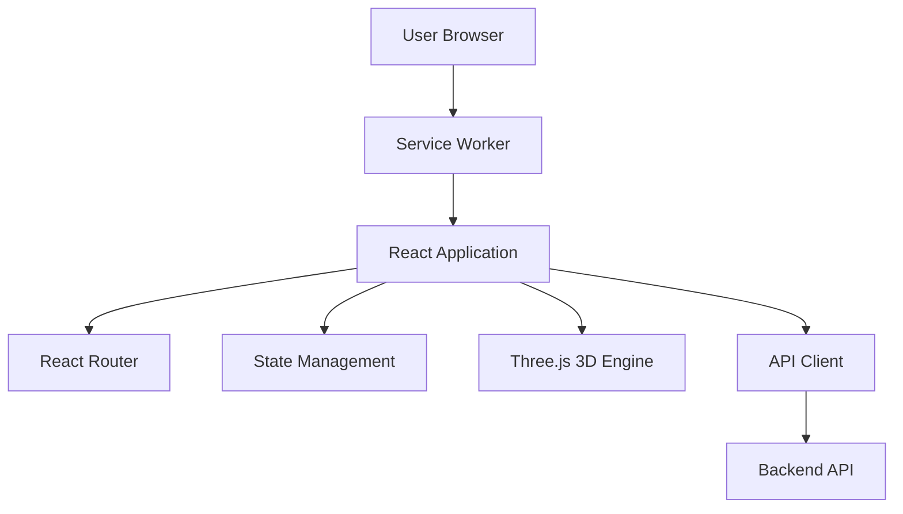

# Frontend Architecture

**Last Updated**: 2026-01-10

## Table of Contents

1. [Overview](#overview)
2. [Application Structure](#application-structure)
3. [Component Architecture](#component-architecture)
4. [State Management](#state-management)
5. [Routing](#routing)
6. [3D Rendering Integration](#3d-rendering-integration)
7. [API Client](#api-client)
8. [Build Optimization](#build-optimization)
9. [PWA Features](#pwa-features)
10. [Performance Optimizations](#performance-optimizations)
11. [Accessibility](#accessibility)
12. [Best Practices](#best-practices)

## Overview

The KitchenXpert frontend is a modern React 18 application featuring advanced 3D
visualization with Three.js, real-time collaboration, and progressive web app
capabilities. It follows atomic design principles and employs cutting-edge
performance optimization techniques.



## Application Structure

```
frontend/
├── public/
│   ├── index.html
│   ├── manifest.json          # PWA manifest
│   ├── robots.txt
│   └── assets/
│       ├── icons/
│       └── images/
├── src/
│   ├── components/            # React components (Atomic Design)
│   │   ├── atoms/             # Basic building blocks
│   │   │   ├── Button/
│   │   │   ├── Input/
│   │   │   ├── Icon/
│   │   │   └── Typography/
│   │   ├── molecules/         # Simple component combinations
│   │   │   ├── FormField/
│   │   │   ├── Card/
│   │   │   └── SearchBar/
│   │   ├── organisms/         # Complex components
│   │   │   ├── Header/
│   │   │   ├── Footer/
│   │   │   ├── Sidebar/
│   │   │   ├── DesignCanvas/
│   │   │   └── CatalogGrid/
│   │   ├── templates/         # Page layouts
│   │   │   ├── MainLayout/
│   │   │   ├── AuthLayout/
│   │   │   └── DashboardLayout/
│   │   └── pages/             # Full pages
│   │       ├── Home/
│   │       ├── Design/
│   │       ├── Catalog/
│   │       └── Profile/
│   ├── hooks/                 # Custom React hooks
│   │   ├── useAuth.js
│   │   ├── useThree.js
│   │   ├── useScene.js
│   │   └── useCamera.js
│   ├── contexts/              # React Context providers
│   │   ├── AuthContext.js
│   │   ├── ThemeContext.js
│   │   └── UserPreferencesContext.js
│   ├── services/              # API and business logic
│   │   ├── api/
│   │   │   ├── client.js
│   │   │   ├── authApi.js
│   │   │   ├── designApi.js
│   │   │   └── catalogApi.js
│   │   └── three/
│   │       ├── SceneManager.js
│   │       ├── CameraController.js
│   │       └── ObjectPool.js
│   ├── utils/                 # Utility functions
│   │   ├── validators.js
│   │   ├── formatters.js
│   │   └── helpers.js
│   ├── styles/                # Global styles
│   │   ├── global.css
│   │   ├── variables.css
│   │   └── themes/
│   ├── assets/                # Static assets
│   │   ├── images/
│   │   ├── fonts/
│   │   └── models/            # 3D models
│   ├── config/                # Configuration
│   │   ├── constants.js
│   │   └── api.config.js
│   ├── App.jsx
│   ├── index.jsx
│   └── service-worker.js      # PWA service worker
├── tests/
│   ├── unit/
│   ├── integration/
│   └── e2e/
├── package.json
├── vite.config.js             # Build configuration
└── tsconfig.json              # TypeScript config
```

## Component Architecture

Following **Atomic Design** methodology for scalable component organization:

### Atoms (Basic Building Blocks)

```jsx
// components/atoms/Button/Button.jsx
import React from 'react';
import PropTypes from 'prop-types';
import styles from './Button.module.css';

const Button = React.memo(
  ({
    children,
    variant = 'primary',
    size = 'medium',
    disabled = false,
    loading = false,
    onClick,
    type = 'button',
    ...props
  }) => {
    const classNames = [
      styles.button,
      styles[variant],
      styles[size],
      disabled && styles.disabled,
      loading && styles.loading,
    ]
      .filter(Boolean)
      .join(' ');

    return (
      <button
        type={type}
        className={classNames}
        onClick={onClick}
        disabled={disabled || loading}
        aria-busy={loading}
        {...props}
      >
        {loading ? <span className={styles.spinner} /> : children}
      </button>
    );
  }
);

Button.propTypes = {
  children: PropTypes.node.isRequired,
  variant: PropTypes.oneOf(['primary', 'secondary', 'tertiary', 'danger']),
  size: PropTypes.oneOf(['small', 'medium', 'large']),
  disabled: PropTypes.bool,
  loading: PropTypes.bool,
  onClick: PropTypes.func,
  type: PropTypes.oneOf(['button', 'submit', 'reset']),
};

export default Button;
```

### Molecules (Component Combinations)

```jsx
// components/molecules/FormField/FormField.jsx
import React from 'react';
import PropTypes from 'prop-types';
import Input from '../../atoms/Input/Input';
import Typography from '../../atoms/Typography/Typography';
import styles from './FormField.module.css';

const FormField = ({
  label,
  name,
  type = 'text',
  value,
  onChange,
  error,
  required = false,
  helpText,
  ...props
}) => {
  return (
    <div className={styles.formField}>
      <label htmlFor={name} className={styles.label}>
        <Typography variant="label">
          {label} {required && <span className={styles.required}>*</span>}
        </Typography>
      </label>

      <Input
        id={name}
        name={name}
        type={type}
        value={value}
        onChange={onChange}
        aria-invalid={!!error}
        aria-describedby={
          error ? `${name}-error` : helpText ? `${name}-help` : undefined
        }
        required={required}
        {...props}
      />

      {helpText && !error && (
        <Typography
          variant="help"
          id={`${name}-help`}
          className={styles.helpText}
        >
          {helpText}
        </Typography>
      )}

      {error && (
        <Typography
          variant="error"
          id={`${name}-error`}
          className={styles.error}
          role="alert"
        >
          {error}
        </Typography>
      )}
    </div>
  );
};

FormField.propTypes = {
  label: PropTypes.string.isRequired,
  name: PropTypes.string.isRequired,
  type: PropTypes.string,
  value: PropTypes.string,
  onChange: PropTypes.func.isRequired,
  error: PropTypes.string,
  required: PropTypes.bool,
  helpText: PropTypes.string,
};

export default FormField;
```

### Organisms (Complex Components)

```jsx
// components/organisms/DesignCanvas/DesignCanvas.jsx
import React, { useRef, useEffect, useCallback } from 'react';
import PropTypes from 'prop-types';
import { useThree } from '../../../hooks/useThree';
import { useScene } from '../../../hooks/useScene';
import { useCamera } from '../../../hooks/useCamera';
import styles from './DesignCanvas.module.css';

const DesignCanvas = ({ design, onUpdate, editable = true }) => {
  const canvasRef = useRef(null);
  const { renderer, scene, camera } = useThree(canvasRef);
  const { updateScene, addObject, removeObject } = useScene(scene, design);
  const { controls } = useCamera(camera, renderer);

  useEffect(() => {
    if (!renderer || !scene || !camera) return;

    // Animation loop
    let animationFrameId;
    const animate = () => {
      animationFrameId = requestAnimationFrame(animate);
      controls?.update();
      renderer.render(scene, camera);
    };

    animate();

    return () => {
      if (animationFrameId) {
        cancelAnimationFrame(animationFrameId);
      }
    };
  }, [renderer, scene, camera, controls]);

  const handleObjectClick = useCallback(
    (event) => {
      if (!editable) return;

      const mouse = {
        x: (event.clientX / window.innerWidth) * 2 - 1,
        y: -(event.clientY / window.innerHeight) * 2 + 1,
      };

      // Raycasting logic here
      // ...
    },
    [editable]
  );

  return (
    <div className={styles.canvasContainer}>
      <canvas
        ref={canvasRef}
        className={styles.canvas}
        onClick={handleObjectClick}
        role="img"
        aria-label="3D kitchen design canvas"
      />
      {editable && (
        <div className={styles.toolbar}>{/* Toolbar controls */}</div>
      )}
    </div>
  );
};

DesignCanvas.propTypes = {
  design: PropTypes.object.isRequired,
  onUpdate: PropTypes.func,
  editable: PropTypes.bool,
};

export default DesignCanvas;
```

### Templates (Page Layouts)

```jsx
// components/templates/MainLayout/MainLayout.jsx
import React from 'react';
import PropTypes from 'prop-types';
import Header from '../../organisms/Header/Header';
import Footer from '../../organisms/Footer/Footer';
import Sidebar from '../../organisms/Sidebar/Sidebar';
import styles from './MainLayout.module.css';

const MainLayout = ({ children, showSidebar = false }) => {
  return (
    <div className={styles.layout}>
      <Header />

      <div className={styles.content}>
        {showSidebar && (
          <aside className={styles.sidebar}>
            <Sidebar />
          </aside>
        )}

        <main className={styles.main} role="main">
          {children}
        </main>
      </div>

      <Footer />
    </div>
  );
};

MainLayout.propTypes = {
  children: PropTypes.node.isRequired,
  showSidebar: PropTypes.bool,
};

export default MainLayout;
```

## State Management

Multi-layered approach using Context API and React Query:

### Auth Context

```jsx
// contexts/AuthContext.js
import React, {
  createContext,
  useContext,
  useState,
  useEffect,
  useCallback,
} from 'react';
import { authApi } from '../services/api/authApi';

const AuthContext = createContext(null);

export const AuthProvider = ({ children }) => {
  const [user, setUser] = useState(null);
  const [loading, setLoading] = useState(true);

  useEffect(() => {
    // Check for existing session
    const initAuth = async () => {
      const token = localStorage.getItem('accessToken');
      if (token) {
        try {
          const userData = await authApi.getProfile();
          setUser(userData);
        } catch (error) {
          localStorage.removeItem('accessToken');
          localStorage.removeItem('refreshToken');
        }
      }
      setLoading(false);
    };

    initAuth();
  }, []);

  const login = useCallback(async (email, password) => {
    const { accessToken, refreshToken, user } = await authApi.login(
      email,
      password
    );

    localStorage.setItem('accessToken', accessToken);
    localStorage.setItem('refreshToken', refreshToken);
    setUser(user);

    return user;
  }, []);

  const logout = useCallback(async () => {
    await authApi.logout();
    localStorage.removeItem('accessToken');
    localStorage.removeItem('refreshToken');
    setUser(null);
  }, []);

  const updateProfile = useCallback(async (updates) => {
    const updatedUser = await authApi.updateProfile(updates);
    setUser(updatedUser);
    return updatedUser;
  }, []);

  const value = {
    user,
    loading,
    login,
    logout,
    updateProfile,
    isAuthenticated: !!user,
  };

  return <AuthContext.Provider value={value}>{children}</AuthContext.Provider>;
};

export const useAuth = () => {
  const context = useContext(AuthContext);
  if (!context) {
    throw new Error('useAuth must be used within AuthProvider');
  }
  return context;
};
```

### React Query for Server State

```jsx
// hooks/useDesigns.js
import { useQuery, useMutation, useQueryClient } from '@tanstack/react-query';
import { designApi } from '../services/api/designApi';

export const useDesigns = () => {
  return useQuery({
    queryKey: ['designs'],
    queryFn: designApi.getAll,
    staleTime: 5 * 60 * 1000, // 5 minutes
    cacheTime: 10 * 60 * 1000, // 10 minutes
  });
};

export const useDesign = (id) => {
  return useQuery({
    queryKey: ['design', id],
    queryFn: () => designApi.getById(id),
    enabled: !!id,
    staleTime: 5 * 60 * 1000,
  });
};

export const useCreateDesign = () => {
  const queryClient = useQueryClient();

  return useMutation({
    mutationFn: designApi.create,
    onSuccess: (newDesign) => {
      // Optimistic update
      queryClient.setQueryData(['designs'], (old) => [
        ...(old || []),
        newDesign,
      ]);

      // Invalidate to refetch
      queryClient.invalidateQueries({ queryKey: ['designs'] });
    },
  });
};

export const useUpdateDesign = () => {
  const queryClient = useQueryClient();

  return useMutation({
    mutationFn: ({ id, data }) => designApi.update(id, data),
    onMutate: async ({ id, data }) => {
      // Cancel outgoing refetches
      await queryClient.cancelQueries({ queryKey: ['design', id] });

      // Snapshot previous value
      const previousDesign = queryClient.getQueryData(['design', id]);

      // Optimistically update
      queryClient.setQueryData(['design', id], (old) => ({ ...old, ...data }));

      return { previousDesign };
    },
    onError: (err, { id }, context) => {
      // Rollback on error
      queryClient.setQueryData(['design', id], context.previousDesign);
    },
    onSettled: (data, error, { id }) => {
      // Always refetch after error or success
      queryClient.invalidateQueries({ queryKey: ['design', id] });
      queryClient.invalidateQueries({ queryKey: ['designs'] });
    },
  });
};
```

### Local Component State

```jsx
// Example: Form state management
import React, { useState, useCallback } from 'react';

const DesignForm = () => {
  const [formData, setFormData] = useState({
    name: '',
    description: '',
    style: 'modern',
    dimensions: { width: 0, height: 0, depth: 0 },
  });

  const [errors, setErrors] = useState({});

  const handleChange = useCallback(
    (field) => (event) => {
      setFormData((prev) => ({
        ...prev,
        [field]: event.target.value,
      }));

      // Clear error on change
      setErrors((prev) => {
        const next = { ...prev };
        delete next[field];
        return next;
      });
    },
    []
  );

  const handleDimensionChange = useCallback(
    (dimension) => (event) => {
      setFormData((prev) => ({
        ...prev,
        dimensions: {
          ...prev.dimensions,
          [dimension]: parseFloat(event.target.value) || 0,
        },
      }));
    },
    []
  );

  // Rest of component...
};
```

## Routing

React Router v6 with lazy loading and protected routes:

```jsx
// App.jsx
import React, { lazy, Suspense } from 'react';
import { BrowserRouter, Routes, Route, Navigate } from 'react-router-dom';
import { QueryClient, QueryClientProvider } from '@tanstack/react-query';
import { AuthProvider } from './contexts/AuthContext';
import { ThemeProvider } from './contexts/ThemeContext';
import LoadingSpinner from './components/atoms/LoadingSpinner/LoadingSpinner';
import ProtectedRoute from './components/ProtectedRoute';

// Lazy load pages
const Home = lazy(() => import('./components/pages/Home/Home'));
const Login = lazy(() => import('./components/pages/Login/Login'));
const Register = lazy(() => import('./components/pages/Register/Register'));
const Dashboard = lazy(() => import('./components/pages/Dashboard/Dashboard'));
const Design = lazy(() => import('./components/pages/Design/Design'));
const Catalog = lazy(() => import('./components/pages/Catalog/Catalog'));
const Profile = lazy(() => import('./components/pages/Profile/Profile'));

const queryClient = new QueryClient({
  defaultOptions: {
    queries: {
      refetchOnWindowFocus: false,
      retry: 1,
      staleTime: 5 * 60 * 1000,
    },
  },
});

const App = () => {
  return (
    <QueryClientProvider client={queryClient}>
      <AuthProvider>
        <ThemeProvider>
          <BrowserRouter>
            <Suspense fallback={<LoadingSpinner fullScreen />}>
              <Routes>
                {/* Public routes */}
                <Route path="/" element={<Home />} />
                <Route path="/login" element={<Login />} />
                <Route path="/register" element={<Register />} />
                <Route path="/catalog" element={<Catalog />} />

                {/* Protected routes */}
                <Route
                  path="/dashboard"
                  element={
                    <ProtectedRoute>
                      <Dashboard />
                    </ProtectedRoute>
                  }
                />
                <Route
                  path="/design/:id?"
                  element={
                    <ProtectedRoute>
                      <Design />
                    </ProtectedRoute>
                  }
                />
                <Route
                  path="/profile"
                  element={
                    <ProtectedRoute>
                      <Profile />
                    </ProtectedRoute>
                  }
                />

                {/* Nested routes example */}
                <Route
                  path="/admin"
                  element={<ProtectedRoute requireRole="admin" />}
                >
                  <Route index element={<Navigate to="users" replace />} />
                  <Route
                    path="users"
                    element={lazy(
                      () => import('./components/pages/Admin/Users')
                    )}
                  />
                  <Route
                    path="analytics"
                    element={lazy(
                      () => import('./components/pages/Admin/Analytics')
                    )}
                  />
                </Route>

                {/* 404 */}
                <Route path="*" element={<Navigate to="/" replace />} />
              </Routes>
            </Suspense>
          </BrowserRouter>
        </ThemeProvider>
      </AuthProvider>
    </QueryClientProvider>
  );
};

export default App;
```

### Protected Route Component

```jsx
// components/ProtectedRoute.jsx
import React from 'react';
import { Navigate, Outlet } from 'react-router-dom';
import { useAuth } from '../contexts/AuthContext';
import LoadingSpinner from './atoms/LoadingSpinner/LoadingSpinner';

const ProtectedRoute = ({ children, requireRole }) => {
  const { user, loading, isAuthenticated } = useAuth();

  if (loading) {
    return <LoadingSpinner fullScreen />;
  }

  if (!isAuthenticated) {
    return <Navigate to="/login" replace />;
  }

  if (requireRole && user.role !== requireRole) {
    return <Navigate to="/dashboard" replace />;
  }

  return children || <Outlet />;
};

export default ProtectedRoute;
```

## 3D Rendering Integration

Three.js integration with custom hooks for performance:

### useThree Hook

```jsx
// hooks/useThree.js
import { useEffect, useState, useRef } from 'react';
import * as THREE from 'three';

export const useThree = (canvasRef) => {
  const [three, setThree] = useState({
    renderer: null,
    scene: null,
    camera: null,
  });

  const rendererRef = useRef(null);

  useEffect(() => {
    if (!canvasRef.current) return;

    const canvas = canvasRef.current;

    // Renderer
    const renderer = new THREE.WebGLRenderer({
      canvas,
      antialias: true,
      alpha: true,
    });
    renderer.setSize(window.innerWidth, window.innerHeight);
    renderer.setPixelRatio(Math.min(window.devicePixelRatio, 2));
    renderer.shadowMap.enabled = true;
    renderer.shadowMap.type = THREE.PCFSoftShadowMap;
    rendererRef.current = renderer;

    // Scene
    const scene = new THREE.Scene();
    scene.background = new THREE.Color(0xf0f0f0);

    // Camera
    const camera = new THREE.PerspectiveCamera(
      75,
      window.innerWidth / window.innerHeight,
      0.1,
      1000
    );
    camera.position.set(5, 5, 5);
    camera.lookAt(0, 0, 0);

    // Lights
    const ambientLight = new THREE.AmbientLight(0xffffff, 0.6);
    scene.add(ambientLight);

    const directionalLight = new THREE.DirectionalLight(0xffffff, 0.8);
    directionalLight.position.set(10, 10, 10);
    directionalLight.castShadow = true;
    directionalLight.shadow.mapSize.width = 2048;
    directionalLight.shadow.mapSize.height = 2048;
    scene.add(directionalLight);

    setThree({ renderer, scene, camera });

    // Handle resize
    const handleResize = () => {
      camera.aspect = window.innerWidth / window.innerHeight;
      camera.updateProjectionMatrix();
      renderer.setSize(window.innerWidth, window.innerHeight);
    };

    window.addEventListener('resize', handleResize);

    return () => {
      window.removeEventListener('resize', handleResize);
      renderer.dispose();
    };
  }, [canvasRef]);

  return three;
};
```

### useScene Hook

```jsx
// hooks/useScene.js
import { useEffect, useCallback } from 'react';
import * as THREE from 'three';
import { GLTFLoader } from 'three/examples/jsm/loaders/GLTFLoader';

export const useScene = (scene, design) => {
  const loaderRef = useRef(new GLTFLoader());

  useEffect(() => {
    if (!scene || !design) return;

    // Clear existing objects
    while (scene.children.length > 0) {
      const object = scene.children[0];
      scene.remove(object);
      if (object.geometry) object.geometry.dispose();
      if (object.material) {
        if (Array.isArray(object.material)) {
          object.material.forEach((m) => m.dispose());
        } else {
          object.material.dispose();
        }
      }
    }

    // Add floor
    const floorGeometry = new THREE.PlaneGeometry(20, 20);
    const floorMaterial = new THREE.MeshStandardMaterial({ color: 0xcccccc });
    const floor = new THREE.Mesh(floorGeometry, floorMaterial);
    floor.rotation.x = -Math.PI / 2;
    floor.receiveShadow = true;
    scene.add(floor);

    // Load design objects
    design.layout?.appliances?.forEach((appliance) => {
      loadAppliance(appliance, scene);
    });

    design.layout?.cabinets?.forEach((cabinet) => {
      loadCabinet(cabinet, scene);
    });
  }, [scene, design]);

  const loadAppliance = useCallback((appliance, scene) => {
    loaderRef.current.load(
      appliance.modelUrl,
      (gltf) => {
        const model = gltf.scene;
        model.position.set(appliance.x, appliance.y, appliance.z);
        model.rotation.y = appliance.rotation || 0;
        model.traverse((child) => {
          if (child.isMesh) {
            child.castShadow = true;
            child.receiveShadow = true;
          }
        });
        scene.add(model);
      },
      undefined,
      (error) => {
        console.error('Error loading appliance:', error);
      }
    );
  }, []);

  const addObject = useCallback(
    (object) => {
      if (!scene) return;
      scene.add(object);
    },
    [scene]
  );

  const removeObject = useCallback(
    (object) => {
      if (!scene) return;
      scene.remove(object);
    },
    [scene]
  );

  return { addObject, removeObject };
};
```

### useCamera Hook

```jsx
// hooks/useCamera.js
import { useEffect, useState } from 'react';
import { OrbitControls } from 'three/examples/jsm/controls/OrbitControls';

export const useCamera = (camera, renderer) => {
  const [controls, setControls] = useState(null);

  useEffect(() => {
    if (!camera || !renderer) return;

    const orbitControls = new OrbitControls(camera, renderer.domElement);
    orbitControls.enableDamping = true;
    orbitControls.dampingFactor = 0.05;
    orbitControls.minDistance = 2;
    orbitControls.maxDistance = 50;
    orbitControls.maxPolarAngle = Math.PI / 2;

    setControls(orbitControls);

    return () => {
      orbitControls.dispose();
    };
  }, [camera, renderer]);

  return { controls };
};
```

### Object Pooling for Performance

```jsx
// services/three/ObjectPool.js
class ObjectPool {
  constructor(factory, initialSize = 10) {
    this.factory = factory;
    this.available = [];
    this.inUse = new Set();

    // Pre-populate pool
    for (let i = 0; i < initialSize; i++) {
      this.available.push(this.factory());
    }
  }

  acquire() {
    let object;

    if (this.available.length > 0) {
      object = this.available.pop();
    } else {
      object = this.factory();
    }

    this.inUse.add(object);
    return object;
  }

  release(object) {
    if (this.inUse.has(object)) {
      this.inUse.delete(object);
      this.available.push(object);
    }
  }

  clear() {
    this.available = [];
    this.inUse.clear();
  }
}

export default ObjectPool;
```

## API Client

Axios-based API client with interceptors:

```jsx
// services/api/client.js
import axios from 'axios';

const apiClient = axios.create({
  baseURL: import.meta.env.VITE_API_BASE_URL || 'http://localhost:3001/api/v1',
  timeout: 30000,
  headers: {
    'Content-Type': 'application/json',
  },
});

// Request interceptor - Add auth token
apiClient.interceptors.request.use(
  (config) => {
    const token = localStorage.getItem('accessToken');
    if (token) {
      config.headers.Authorization = `Bearer ${token}`;
    }
    return config;
  },
  (error) => {
    return Promise.reject(error);
  }
);

// Response interceptor - Handle errors and token refresh
apiClient.interceptors.response.use(
  (response) => response.data,
  async (error) => {
    const originalRequest = error.config;

    // Token expired - attempt refresh
    if (error.response?.status === 401 && !originalRequest._retry) {
      originalRequest._retry = true;

      try {
        const refreshToken = localStorage.getItem('refreshToken');
        const response = await axios.post(
          `${apiClient.defaults.baseURL}/auth/refresh`,
          { refreshToken }
        );

        const { accessToken } = response.data;
        localStorage.setItem('accessToken', accessToken);

        // Retry original request
        originalRequest.headers.Authorization = `Bearer ${accessToken}`;
        return apiClient(originalRequest);
      } catch (refreshError) {
        // Refresh failed - logout
        localStorage.removeItem('accessToken');
        localStorage.removeItem('refreshToken');
        window.location.href = '/login';
        return Promise.reject(refreshError);
      }
    }

    // Network error - retry logic
    if (!error.response && originalRequest._retryCount < 3) {
      originalRequest._retryCount = (originalRequest._retryCount || 0) + 1;

      // Exponential backoff
      const delay = Math.pow(2, originalRequest._retryCount) * 1000;
      await new Promise((resolve) => setTimeout(resolve, delay));

      return apiClient(originalRequest);
    }

    return Promise.reject(error);
  }
);

export default apiClient;
```

### API Service Example

```jsx
// services/api/designApi.js
import apiClient from './client';

export const designApi = {
  getAll: async () => {
    return apiClient.get('/kitchen/designs');
  },

  getById: async (id) => {
    return apiClient.get(`/kitchen/designs/${id}`);
  },

  create: async (data) => {
    return apiClient.post('/kitchen/designs', data);
  },

  update: async (id, data) => {
    return apiClient.put(`/kitchen/designs/${id}`, data);
  },

  delete: async (id) => {
    return apiClient.delete(`/kitchen/designs/${id}`);
  },

  share: async (id) => {
    return apiClient.post(`/kitchen/designs/${id}/share`);
  },
};
```

## Build Optimization

Vite configuration for optimal performance:

```javascript
// vite.config.js
import { defineConfig } from 'vite';
import react from '@vitejs/plugin-react';
import { visualizer } from 'rollup-plugin-visualizer';
import compression from 'vite-plugin-compression';

export default defineConfig({
  plugins: [
    react(),
    compression({
      algorithm: 'gzip',
      ext: '.gz',
    }),
    compression({
      algorithm: 'brotliCompress',
      ext: '.br',
    }),
    visualizer({
      filename: './dist/stats.html',
      open: false,
      gzipSize: true,
      brotliSize: true,
    }),
  ],
  build: {
    target: 'es2015',
    outDir: 'dist',
    assetsDir: 'assets',
    sourcemap: false,
    minify: 'terser',
    terserOptions: {
      compress: {
        drop_console: true,
        drop_debugger: true,
      },
    },
    rollupOptions: {
      output: {
        manualChunks: {
          'react-vendor': ['react', 'react-dom', 'react-router-dom'],
          'three-vendor': ['three'],
          'query-vendor': ['@tanstack/react-query'],
        },
        chunkFileNames: 'assets/[name]-[hash].js',
        entryFileNames: 'assets/[name]-[hash].js',
        assetFileNames: 'assets/[name]-[hash].[ext]',
      },
    },
    chunkSizeWarningLimit: 1000,
  },
  optimizeDeps: {
    include: ['react', 'react-dom', 'three'],
  },
});
```

### Code Splitting Strategy

```jsx
// Lazy loading with named chunks
const AdminPanel = lazy(
  () =>
    import(
      /* webpackChunkName: "admin" */ './components/pages/Admin/AdminPanel'
    )
);

const Analytics = lazy(
  () =>
    import(
      /* webpackChunkName: "analytics" */ './components/pages/Analytics/Analytics'
    )
);
```

## PWA Features

### Manifest Configuration

```json
// public/manifest.json
{
  "name": "KitchenXpert",
  "short_name": "KitchenXpert",
  "description": "AI-powered kitchen design and appliance marketplace",
  "start_url": "/",
  "display": "standalone",
  "background_color": "#ffffff",
  "theme_color": "#4F46E5",
  "orientation": "portrait-primary",
  "icons": [
    {
      "src": "/assets/icons/icon-72x72.png",
      "sizes": "72x72",
      "type": "image/png"
    },
    {
      "src": "/assets/icons/icon-96x96.png",
      "sizes": "96x96",
      "type": "image/png"
    },
    {
      "src": "/assets/icons/icon-128x128.png",
      "sizes": "128x128",
      "type": "image/png"
    },
    {
      "src": "/assets/icons/icon-144x144.png",
      "sizes": "144x144",
      "type": "image/png"
    },
    {
      "src": "/assets/icons/icon-152x152.png",
      "sizes": "152x152",
      "type": "image/png"
    },
    {
      "src": "/assets/icons/icon-192x192.png",
      "sizes": "192x192",
      "type": "image/png"
    },
    {
      "src": "/assets/icons/icon-384x384.png",
      "sizes": "384x384",
      "type": "image/png"
    },
    {
      "src": "/assets/icons/icon-512x512.png",
      "sizes": "512x512",
      "type": "image/png"
    }
  ],
  "categories": ["lifestyle", "productivity"],
  "screenshots": [
    {
      "src": "/assets/screenshots/desktop.png",
      "sizes": "1280x720",
      "type": "image/png",
      "form_factor": "wide"
    },
    {
      "src": "/assets/screenshots/mobile.png",
      "sizes": "750x1334",
      "type": "image/png",
      "form_factor": "narrow"
    }
  ]
}
```

### Service Worker (Workbox)

```javascript
// src/service-worker.js
import { precacheAndRoute } from 'workbox-precaching';
import { registerRoute } from 'workbox-routing';
import {
  CacheFirst,
  NetworkFirst,
  StaleWhileRevalidate,
} from 'workbox-strategies';
import { ExpirationPlugin } from 'workbox-expiration';
import { CacheableResponsePlugin } from 'workbox-cacheable-response';

// Precache generated assets
precacheAndRoute(self.__WB_MANIFEST);

// Cache API responses
registerRoute(
  ({ url }) => url.pathname.startsWith('/api/'),
  new NetworkFirst({
    cacheName: 'api-cache',
    plugins: [
      new CacheableResponsePlugin({
        statuses: [0, 200],
      }),
      new ExpirationPlugin({
        maxEntries: 50,
        maxAgeSeconds: 5 * 60, // 5 minutes
      }),
    ],
  })
);

// Cache images
registerRoute(
  ({ request }) => request.destination === 'image',
  new CacheFirst({
    cacheName: 'image-cache',
    plugins: [
      new CacheableResponsePlugin({
        statuses: [0, 200],
      }),
      new ExpirationPlugin({
        maxEntries: 100,
        maxAgeSeconds: 30 * 24 * 60 * 60, // 30 days
      }),
    ],
  })
);

// Cache 3D models
registerRoute(
  ({ url }) => url.pathname.endsWith('.gltf') || url.pathname.endsWith('.glb'),
  new CacheFirst({
    cacheName: '3d-model-cache',
    plugins: [
      new ExpirationPlugin({
        maxEntries: 20,
        maxAgeSeconds: 7 * 24 * 60 * 60, // 7 days
      }),
    ],
  })
);

// Cache fonts
registerRoute(
  ({ request }) => request.destination === 'font',
  new CacheFirst({
    cacheName: 'font-cache',
    plugins: [
      new ExpirationPlugin({
        maxEntries: 10,
        maxAgeSeconds: 365 * 24 * 60 * 60, // 1 year
      }),
    ],
  })
);
```

## Performance Optimizations

### React.memo for Component Memoization

```jsx
// Memoize expensive components
const ExpensiveComponent = React.memo(
  ({ data }) => {
    // Expensive rendering logic
    return <div>{/* ... */}</div>;
  },
  (prevProps, nextProps) => {
    // Custom comparison
    return prevProps.data.id === nextProps.data.id;
  }
);
```

### useMemo for Expensive Calculations

```jsx
const DesignList = ({ designs, filter }) => {
  const filteredDesigns = useMemo(() => {
    return designs
      .filter((design) => {
        return design.style === filter || filter === 'all';
      })
      .sort((a, b) => new Date(b.createdAt) - new Date(a.createdAt));
  }, [designs, filter]);

  return (
    <ul>
      {filteredDesigns.map((design) => (
        <DesignCard key={design.id} design={design} />
      ))}
    </ul>
  );
};
```

### useCallback for Function Memoization

```jsx
const ParentComponent = () => {
  const [count, setCount] = useState(0);

  const handleClick = useCallback(() => {
    console.log('Clicked');
  }, []); // Dependencies array

  return <ChildComponent onClick={handleClick} />;
};
```

### Virtual Scrolling for Large Lists

```jsx
// Using react-window
import { FixedSizeList } from 'react-window';

const CatalogList = ({ items }) => {
  const Row = ({ index, style }) => (
    <div style={style}>
      <CatalogItem item={items[index]} />
    </div>
  );

  return (
    <FixedSizeList
      height={600}
      itemCount={items.length}
      itemSize={120}
      width="100%"
    >
      {Row}
    </FixedSizeList>
  );
};
```

## Accessibility

WCAG 2.1 AA compliance:

### Semantic HTML

```jsx
// Use proper semantic elements
<header>
  <nav aria-label="Main navigation">
    <ul>
      <li><a href="/">Home</a></li>
      <li><a href="/catalog">Catalog</a></li>
    </ul>
  </nav>
</header>

<main>
  <article>
    <h1>Kitchen Design</h1>
    <section>
      {/* Content */}
    </section>
  </article>
</main>

<footer>
  {/* Footer content */}
</footer>
```

### ARIA Attributes

```jsx
// Properly labeled form fields
<label htmlFor="email">Email</label>
<input
  id="email"
  type="email"
  aria-required="true"
  aria-describedby="email-help"
  aria-invalid={!!errors.email}
/>
<span id="email-help">We'll never share your email</span>

// Live regions for dynamic content
<div role="status" aria-live="polite" aria-atomic="true">
  {message}
</div>

// Modal dialogs
<div
  role="dialog"
  aria-modal="true"
  aria-labelledby="dialog-title"
  aria-describedby="dialog-description"
>
  <h2 id="dialog-title">Confirm Delete</h2>
  <p id="dialog-description">Are you sure you want to delete this design?</p>
</div>
```

### Keyboard Navigation

```jsx
// Keyboard event handling
const KeyboardNavigableList = () => {
  const handleKeyDown = (event) => {
    switch (event.key) {
      case 'ArrowDown':
        event.preventDefault();
        // Focus next item
        break;
      case 'ArrowUp':
        event.preventDefault();
        // Focus previous item
        break;
      case 'Enter':
      case ' ':
        event.preventDefault();
        // Select item
        break;
      case 'Escape':
        // Close/cancel
        break;
    }
  };

  return (
    <ul onKeyDown={handleKeyDown} role="listbox">
      <li role="option" tabIndex={0}>
        Item 1
      </li>
      <li role="option" tabIndex={-1}>
        Item 2
      </li>
    </ul>
  );
};
```

### Focus Management

```jsx
// Focus trap for modals
import { useEffect, useRef } from 'react';

const Modal = ({ isOpen, onClose, children }) => {
  const modalRef = useRef(null);
  const previousFocusRef = useRef(null);

  useEffect(() => {
    if (isOpen) {
      previousFocusRef.current = document.activeElement;
      modalRef.current?.focus();
    } else {
      previousFocusRef.current?.focus();
    }
  }, [isOpen]);

  return isOpen ? (
    <div ref={modalRef} tabIndex={-1} role="dialog">
      {children}
    </div>
  ) : null;
};
```

## Best Practices

1. **Component Design**: Follow atomic design principles for consistency
2. **State Management**: Use appropriate tools (Context for global, React Query
   for server state)
3. **Performance**: Memoize components and callbacks, use virtual scrolling for
   long lists
4. **Accessibility**: Always include ARIA labels, ensure keyboard navigation
5. **Error Boundaries**: Wrap components in error boundaries to prevent full app
   crashes
6. **Testing**: Write unit tests for utilities, integration tests for components
7. **Code Splitting**: Lazy load routes and heavy components
8. **Asset Optimization**: Compress images, use WebP format, lazy load images
9. **Security**: Never store sensitive data in localStorage, sanitize user
   inputs
10. **Documentation**: Document complex components and hooks

## Related Documentation

- [Backend Architecture](./backend.md)
- [AI Modules Architecture](./ai-modules.md)
- [Data Flow Diagrams](./data-flow.md)
- [Security Architecture](./security.md)
- [Component Library](../components/README.md)
- [API Integration Guide](../api/integration.md)
