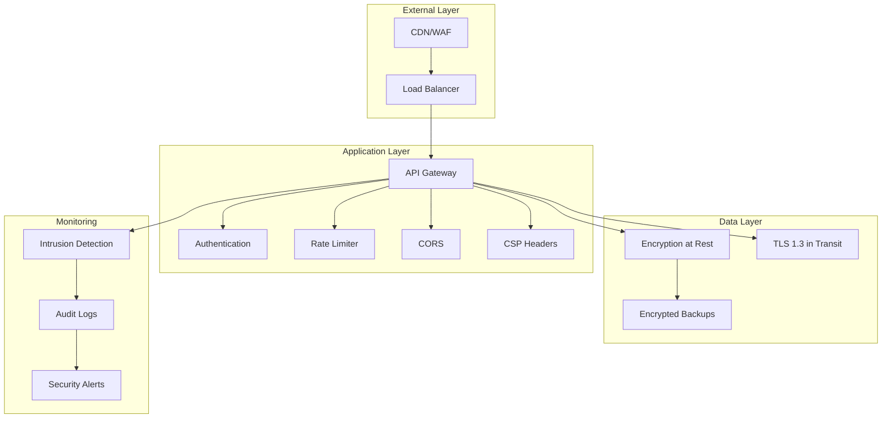

# Security Architecture

**Last Updated**: 2026-01-10

## Table of Contents

1. [Overview](#overview)
2. [Defense in Depth Strategy](#defense-in-depth-strategy)
3. [Authentication](#authentication)
4. [Authorization](#authorization)
5. [Data Encryption](#data-encryption)
6. [Content Security Policy](#content-security-policy)
7. [Rate Limiting](#rate-limiting)
8. [API Key Management](#api-key-management)
9. [GDPR Compliance](#gdpr-compliance)
10. [Security Headers](#security-headers)
11. [Vulnerability Management](#vulnerability-management)
12. [Incident Response Plan](#incident-response-plan)
13. [Best Practices](#best-practices)

## Overview

KitchenXpert implements a comprehensive, defense-in-depth security architecture
that protects user data, ensures privacy compliance, and maintains system
integrity. Security is embedded at every layer of the application stack.



## Defense in Depth Strategy

Multiple layers of security controls:

### Layer 1: Network Security

```javascript
// config/network-security.js
module.exports = {
  // IP whitelisting for admin endpoints
  adminWhitelist: process.env.ADMIN_IP_WHITELIST?.split(',') || [],

  // Rate limiting by IP
  ipRateLimit: {
    windowMs: 15 * 60 * 1000, // 15 minutes
    max: 1000, // Limit each IP to 1000 requests per window
    standardHeaders: true,
    legacyHeaders: false,
  },

  // DDoS protection
  ddosProtection: {
    burst: 10,
    limit: 5,
    maxexpiry: 60,
  },

  // Geo-blocking (if needed)
  blockedCountries: process.env.BLOCKED_COUNTRIES?.split(',') || [],
};
```

### Layer 2: Application Security

```javascript
// middleware/security-stack.js
const helmet = require('helmet');
const cors = require('cors');
const hpp = require('hpp');
const mongoSanitize = require('express-mongo-sanitize');

const securityMiddleware = (app) => {
  // Helmet for security headers
  app.use(
    helmet({
      contentSecurityPolicy: false, // Handled separately
      crossOriginEmbedderPolicy: true,
      crossOriginOpenerPolicy: true,
      crossOriginResourcePolicy: { policy: 'cross-origin' },
      dnsPrefetchControl: true,
      frameguard: { action: 'deny' },
      hidePoweredBy: true,
      hsts: {
        maxAge: 31536000,
        includeSubDomains: true,
        preload: true,
      },
      ieNoOpen: true,
      noSniff: true,
      originAgentCluster: true,
      permittedCrossDomainPolicies: { permittedPolicies: 'none' },
      referrerPolicy: { policy: 'strict-origin-when-cross-origin' },
      xssFilter: true,
    })
  );

  // CORS configuration
  app.use(
    cors({
      origin: (origin, callback) => {
        const allowedOrigins = process.env.ALLOWED_ORIGINS.split(',');
        if (!origin || allowedOrigins.includes(origin)) {
          callback(null, true);
        } else {
          callback(new Error('Not allowed by CORS'));
        }
      },
      credentials: true,
      methods: ['GET', 'POST', 'PUT', 'PATCH', 'DELETE', 'OPTIONS'],
      allowedHeaders: ['Content-Type', 'Authorization', 'X-API-Key'],
      exposedHeaders: ['X-RateLimit-Limit', 'X-RateLimit-Remaining'],
      maxAge: 86400, // 24 hours
    })
  );

  // Prevent HTTP Parameter Pollution
  app.use(hpp());

  // Sanitize MongoDB queries
  app.use(
    mongoSanitize({
      replaceWith: '_',
      onSanitize: ({ req, key }) => {
        console.warn(`Sanitized ${key} in ${req.path}`);
      },
    })
  );

  // Body parser with limits
  app.use(
    express.json({
      limit: '10mb',
      verify: (req, res, buf, encoding) => {
        // Store raw body for webhook signature verification
        req.rawBody = buf.toString(encoding || 'utf8');
      },
    })
  );
  app.use(express.urlencoded({ extended: true, limit: '10mb' }));
};

module.exports = securityMiddleware;
```

### Layer 3: Data Security

Encryption at rest and in transit with key rotation.

## Authentication

Multi-factor authentication with JWT and OAuth2:

### JWT Configuration

```javascript
// config/auth/jwt.js
const jwt = require('jsonwebtoken');
const crypto = require('crypto');

class JWTManager {
  constructor() {
    this.accessTokenSecret = process.env.JWT_SECRET;
    this.refreshTokenSecret = process.env.JWT_REFRESH_SECRET;
    this.algorithm = 'HS256';

    // Rotate secrets periodically
    this.secretRotation = {
      current: this.accessTokenSecret,
      previous: process.env.JWT_SECRET_PREVIOUS,
      rotationDate: new Date(
        process.env.JWT_SECRET_ROTATION_DATE || Date.now()
      ),
    };
  }

  generateAccessToken(user) {
    const payload = {
      id: user.id,
      email: user.email,
      role: user.role,
      permissions: this.getRolePermissions(user.role),
      type: 'access',
    };

    return jwt.sign(payload, this.accessTokenSecret, {
      algorithm: this.algorithm,
      expiresIn: '15m',
      issuer: 'kitchenxpert',
      audience: 'kitchenxpert-api',
      jwtid: crypto.randomUUID(),
    });
  }

  generateRefreshToken(user) {
    const payload = {
      id: user.id,
      type: 'refresh',
      tokenFamily: crypto.randomUUID(), // For refresh token rotation
    };

    return jwt.sign(payload, this.refreshTokenSecret, {
      algorithm: this.algorithm,
      expiresIn: '7d',
      issuer: 'kitchenxpert',
      audience: 'kitchenxpert-api',
      jwtid: crypto.randomUUID(),
    });
  }

  verifyAccessToken(token) {
    try {
      // Try current secret
      return jwt.verify(token, this.secretRotation.current, {
        algorithms: [this.algorithm],
        issuer: 'kitchenxpert',
        audience: 'kitchenxpert-api',
      });
    } catch (error) {
      // Try previous secret (during rotation period)
      if (this.secretRotation.previous) {
        return jwt.verify(token, this.secretRotation.previous, {
          algorithms: [this.algorithm],
          issuer: 'kitchenxpert',
          audience: 'kitchenxpert-api',
        });
      }
      throw error;
    }
  }

  verifyRefreshToken(token) {
    return jwt.verify(token, this.refreshTokenSecret, {
      algorithms: [this.algorithm],
      issuer: 'kitchenxpert',
      audience: 'kitchenxpert-api',
    });
  }

  getRolePermissions(role) {
    const permissions = {
      customer: [
        'design:read:own',
        'design:create',
        'design:update:own',
        'design:delete:own',
      ],
      partner: ['catalog:read', 'catalog:create', 'catalog:update:own'],
      admin: ['*:*:*'],
    };

    return permissions[role] || [];
  }
}

module.exports = new JWTManager();
```

### OAuth2 Integration

```javascript
// config/auth/oauth.js
const { OAuth2Client } = require('google-auth-library');
const axios = require('axios');

class OAuthManager {
  constructor() {
    this.providers = {
      google: {
        client: new OAuth2Client(
          process.env.GOOGLE_CLIENT_ID,
          process.env.GOOGLE_CLIENT_SECRET,
          process.env.GOOGLE_REDIRECT_URI
        ),
      },
      github: {
        clientId: process.env.GITHUB_CLIENT_ID,
        clientSecret: process.env.GITHUB_CLIENT_SECRET,
        redirectUri: process.env.GITHUB_REDIRECT_URI,
      },
      microsoft: {
        clientId: process.env.MICROSOFT_CLIENT_ID,
        clientSecret: process.env.MICROSOFT_CLIENT_SECRET,
        redirectUri: process.env.MICROSOFT_REDIRECT_URI,
      },
    };
  }

  async verifyGoogleToken(token) {
    const ticket = await this.providers.google.client.verifyIdToken({
      idToken: token,
      audience: process.env.GOOGLE_CLIENT_ID,
    });

    const payload = ticket.getPayload();

    return {
      email: payload.email,
      firstName: payload.given_name,
      lastName: payload.family_name,
      emailVerified: payload.email_verified,
      picture: payload.picture,
      provider: 'google',
      providerId: payload.sub,
    };
  }

  async verifyGitHubCode(code) {
    // Exchange code for access token
    const tokenResponse = await axios.post(
      'https://github.com/login/oauth/access_token',
      {
        client_id: this.providers.github.clientId,
        client_secret: this.providers.github.clientSecret,
        code,
        redirect_uri: this.providers.github.redirectUri,
      },
      {
        headers: { Accept: 'application/json' },
      }
    );

    const accessToken = tokenResponse.data.access_token;

    // Get user info
    const userResponse = await axios.get('https://api.github.com/user', {
      headers: { Authorization: `Bearer ${accessToken}` },
    });

    const emailResponse = await axios.get(
      'https://api.github.com/user/emails',
      {
        headers: { Authorization: `Bearer ${accessToken}` },
      }
    );

    const primaryEmail = emailResponse.data.find((email) => email.primary);

    return {
      email: primaryEmail.email,
      firstName: userResponse.data.name?.split(' ')[0] || '',
      lastName: userResponse.data.name?.split(' ').slice(1).join(' ') || '',
      emailVerified: primaryEmail.verified,
      picture: userResponse.data.avatar_url,
      provider: 'github',
      providerId: userResponse.data.id.toString(),
    };
  }
}

module.exports = new OAuthManager();
```

### Session Management

```javascript
// services/sessionService.js
const redisClient = require('../config/redis');
const crypto = require('crypto');

class SessionService {
  constructor() {
    this.sessionPrefix = 'session:';
    this.sessionTTL = 7 * 24 * 60 * 60; // 7 days
  }

  async createSession(userId, userAgent, ipAddress) {
    const sessionId = crypto.randomUUID();
    const sessionData = {
      userId,
      userAgent,
      ipAddress,
      createdAt: Date.now(),
      lastActivity: Date.now(),
    };

    await redisClient.setex(
      `${this.sessionPrefix}${sessionId}`,
      this.sessionTTL,
      JSON.stringify(sessionData)
    );

    // Track user sessions
    await redisClient.sadd(`user:${userId}:sessions`, sessionId);

    return sessionId;
  }

  async getSession(sessionId) {
    const data = await redisClient.get(`${this.sessionPrefix}${sessionId}`);
    return data ? JSON.parse(data) : null;
  }

  async updateSessionActivity(sessionId) {
    const session = await this.getSession(sessionId);
    if (session) {
      session.lastActivity = Date.now();
      await redisClient.setex(
        `${this.sessionPrefix}${sessionId}`,
        this.sessionTTL,
        JSON.stringify(session)
      );
    }
  }

  async revokeSession(sessionId) {
    const session = await this.getSession(sessionId);
    if (session) {
      await redisClient.del(`${this.sessionPrefix}${sessionId}`);
      await redisClient.srem(`user:${session.userId}:sessions`, sessionId);
    }
  }

  async revokeAllUserSessions(userId) {
    const sessions = await redisClient.smembers(`user:${userId}:sessions`);

    for (const sessionId of sessions) {
      await redisClient.del(`${this.sessionPrefix}${sessionId}`);
    }

    await redisClient.del(`user:${userId}:sessions`);
  }

  async getUserActiveSessions(userId) {
    const sessionIds = await redisClient.smembers(`user:${userId}:sessions`);
    const sessions = [];

    for (const sessionId of sessionIds) {
      const session = await this.getSession(sessionId);
      if (session) {
        sessions.push({ sessionId, ...session });
      }
    }

    return sessions;
  }
}

module.exports = new SessionService();
```

## Authorization

Role-Based Access Control (RBAC) with fine-grained permissions:

### Permission System

```javascript
// middleware/authorization.js
const { ForbiddenError } = require('../middleware/errorHandler');

const permissions = {
  customer: {
    design: ['read:own', 'create', 'update:own', 'delete:own'],
    catalog: ['read'],
    order: ['create:own', 'read:own'],
    user: ['read:own', 'update:own'],
  },
  partner: {
    design: ['read:own', 'create', 'update:own', 'delete:own'],
    catalog: ['read', 'create', 'update:own', 'delete:own'],
    order: ['read:own'],
    partner: ['read:own', 'update:own'],
    webhook: ['read:own', 'create:own', 'update:own', 'delete:own'],
  },
  admin: {
    design: ['read:all', 'update:all', 'delete:all'],
    catalog: ['read', 'create', 'update:all', 'delete:all'],
    order: ['read:all', 'update:all', 'delete:all'],
    user: ['read:all', 'update:all', 'delete:all', 'create'],
    partner: ['read:all', 'update:all', 'delete:all', 'create'],
    webhook: ['read:all', 'update:all', 'delete:all'],
    system: ['configure', 'monitor', 'audit'],
  },
};

class AuthorizationService {
  hasPermission(user, resource, action, ownership = 'any') {
    const userRole = user.role;
    const rolePermissions = permissions[userRole];

    if (!rolePermissions || !rolePermissions[resource]) {
      return false;
    }

    const requiredPermission = `${action}:${ownership}`;
    const resourcePermissions = rolePermissions[resource];

    // Check exact match
    if (resourcePermissions.includes(requiredPermission)) {
      return true;
    }

    // Check wildcard (action:all)
    if (resourcePermissions.includes(`${action}:all`)) {
      return true;
    }

    // Check admin wildcard
    if (resourcePermissions.includes('*:*:*')) {
      return true;
    }

    return false;
  }

  checkOwnership(user, resource) {
    // Check if user owns the resource
    if (resource.userId && resource.userId === user.id) {
      return true;
    }

    if (resource.partnerId && resource.partnerId === user.partnerId) {
      return true;
    }

    return false;
  }

  async authorize(req, res, next, requiredPermission) {
    const user = req.user;

    if (!user) {
      throw new ForbiddenError('Authentication required');
    }

    const [resource, action, ownership] = requiredPermission.split(':');

    // Check permission
    if (!this.hasPermission(user, resource, action, ownership)) {
      throw new ForbiddenError('Insufficient permissions');
    }

    // If ownership check required
    if (ownership === 'own') {
      const resourceData = await this.getResource(req);

      if (!this.checkOwnership(user, resourceData)) {
        throw new ForbiddenError('You do not own this resource');
      }
    }

    next();
  }

  async getResource(req) {
    // Extract resource from request based on route
    // This is route-specific logic
    return req.resource || {};
  }
}

const authService = new AuthorizationService();

// Middleware factory
const checkPermission = (requiredPermission) => {
  return async (req, res, next) => {
    try {
      await authService.authorize(req, res, next, requiredPermission);
    } catch (error) {
      next(error);
    }
  };
};

module.exports = { checkPermission, authService };
```

### Resource Ownership Validation

```javascript
// middleware/ownership.js
const { ForbiddenError, NotFoundError } = require('./errorHandler');

const checkDesignOwnership = async (req, res, next) => {
  const designId = req.params.id;
  const userId = req.user.id;

  const design = await Design.findById(designId);

  if (!design) {
    throw new NotFoundError('Design not found');
  }

  if (design.userId !== userId && req.user.role !== 'admin') {
    throw new ForbiddenError(
      'You do not have permission to access this design'
    );
  }

  req.resource = design;
  next();
};

const checkCatalogItemOwnership = async (req, res, next) => {
  const itemId = req.params.id;
  const partnerId = req.user.partnerId;

  const item = await CatalogItem.findById(itemId);

  if (!item) {
    throw new NotFoundError('Catalog item not found');
  }

  if (item.partnerId !== partnerId && req.user.role !== 'admin') {
    throw new ForbiddenError('You do not have permission to access this item');
  }

  req.resource = item;
  next();
};

module.exports = {
  checkDesignOwnership,
  checkCatalogItemOwnership,
};
```

## Data Encryption

### At Rest (AES-256-GCM)

```javascript
// utils/encryption.js
const crypto = require('crypto');

class EncryptionService {
  constructor() {
    this.algorithm = 'aes-256-gcm';
    this.keyLength = 32; // 256 bits
    this.ivLength = 16; // 128 bits
    this.tagLength = 16; // 128 bits
    this.saltLength = 64;

    // Master key from environment (base64 encoded)
    this.masterKey = Buffer.from(process.env.ENCRYPTION_KEY, 'base64');

    if (this.masterKey.length !== this.keyLength) {
      throw new Error('Invalid encryption key length');
    }
  }

  encrypt(plaintext) {
    // Generate random IV
    const iv = crypto.randomBytes(this.ivLength);

    // Create cipher
    const cipher = crypto.createCipheriv(this.algorithm, this.masterKey, iv);

    // Encrypt data
    let encrypted = cipher.update(plaintext, 'utf8', 'base64');
    encrypted += cipher.final('base64');

    // Get auth tag
    const authTag = cipher.getAuthTag();

    // Return encrypted data with IV and auth tag
    return {
      encrypted,
      iv: iv.toString('base64'),
      authTag: authTag.toString('base64'),
    };
  }

  decrypt(encryptedData) {
    const { encrypted, iv, authTag } = encryptedData;

    // Create decipher
    const decipher = crypto.createDecipheriv(
      this.algorithm,
      this.masterKey,
      Buffer.from(iv, 'base64')
    );

    // Set auth tag
    decipher.setAuthTag(Buffer.from(authTag, 'base64'));

    // Decrypt
    let decrypted = decipher.update(encrypted, 'base64', 'utf8');
    decrypted += decipher.final('utf8');

    return decrypted;
  }

  // Hash sensitive data (one-way)
  hash(data, salt = null) {
    if (!salt) {
      salt = crypto.randomBytes(this.saltLength);
    }

    const hash = crypto.pbkdf2Sync(
      data,
      salt,
      100000, // iterations
      64, // key length
      'sha512'
    );

    return {
      hash: hash.toString('base64'),
      salt: salt.toString('base64'),
    };
  }

  verifyHash(data, storedHash, storedSalt) {
    const { hash } = this.hash(data, Buffer.from(storedSalt, 'base64'));
    return hash === storedHash;
  }

  // Field-level encryption for database
  encryptField(value) {
    if (!value) return null;

    const { encrypted, iv, authTag } = this.encrypt(value);
    return `${encrypted}:${iv}:${authTag}`;
  }

  decryptField(encryptedValue) {
    if (!encryptedValue) return null;

    const [encrypted, iv, authTag] = encryptedValue.split(':');
    return this.decrypt({ encrypted, iv, authTag });
  }
}

module.exports = new EncryptionService();
```

### In Transit (TLS 1.3)

```javascript
// config/tls.js
const fs = require('fs');
const https = require('https');

const tlsConfig = {
  // TLS 1.3 only (most secure)
  minVersion: 'TLSv1.3',
  maxVersion: 'TLSv1.3',

  // Certificate and key
  cert: fs.readFileSync(process.env.TLS_CERT_PATH),
  key: fs.readFileSync(process.env.TLS_KEY_PATH),
  ca: fs.readFileSync(process.env.TLS_CA_PATH),

  // Strong cipher suites for TLS 1.3
  cipherSuites: [
    'TLS_AES_256_GCM_SHA384',
    'TLS_CHACHA20_POLY1305_SHA256',
    'TLS_AES_128_GCM_SHA256',
  ].join(':'),

  // Security options
  honorCipherOrder: true,
  requestCert: false,
  rejectUnauthorized: true,

  // OCSP stapling
  enableOCSPStapling: true,

  // Session resumption
  sessionTimeout: 300, // 5 minutes
  ticketKeys: [crypto.randomBytes(48), crypto.randomBytes(48)],
};

// Create HTTPS server
const createSecureServer = (app) => {
  return https.createServer(tlsConfig, app);
};

module.exports = { tlsConfig, createSecureServer };
```

## Content Security Policy

Comprehensive CSP configuration:

```javascript
// config/security/csp.js
const cspConfig = {
  directives: {
    defaultSrc: ["'self'"],

    scriptSrc: [
      "'self'",
      "'nonce-{NONCE}'", // Dynamic nonce for inline scripts
      'https://cdn.jsdelivr.net',
      'https://unpkg.com',
    ],

    scriptSrcElem: ["'self'", 'https://cdn.jsdelivr.net', 'https://unpkg.com'],

    scriptSrcAttr: ["'none'"],

    styleSrc: ["'self'", "'nonce-{NONCE}'", 'https://fonts.googleapis.com'],

    styleSrcElem: ["'self'", 'https://fonts.googleapis.com'],

    styleSrcAttr: ["'unsafe-inline'"], // For dynamic styles in 3D canvas

    fontSrc: ["'self'", 'https://fonts.gstatic.com'],

    imgSrc: ["'self'", 'data:', 'blob:', 'https:', process.env.S3_BUCKET_URL],

    mediaSrc: ["'self'", process.env.S3_BUCKET_URL],

    objectSrc: ["'none'"],

    frameSrc: [
      "'self'",
      'https://www.google.com', // reCAPTCHA
      'https://js.stripe.com', // Payment
    ],

    frameAncestors: ["'none'"],

    formAction: ["'self'"],

    baseUri: ["'self'"],

    connectSrc: [
      "'self'",
      process.env.API_URL,
      process.env.WS_URL,
      process.env.AI_SERVICE_URL,
      'https://api.stripe.com',
    ],

    workerSrc: ["'self'", 'blob:'],

    manifestSrc: ["'self'"],

    upgradeInsecureRequests: [],

    blockAllMixedContent: [],
  },

  reportOnly: process.env.NODE_ENV === 'development',

  reportUri: '/api/v1/security/csp-report',
};

const cspMiddleware = (req, res, next) => {
  // Generate nonce for this request
  const nonce = crypto.randomBytes(16).toString('base64');
  req.nonce = nonce;

  // Build CSP header
  let cspHeader = Object.entries(cspConfig.directives)
    .map(([directive, values]) => {
      if (values.length === 0) return directive;

      const processedValues = values.map((value) =>
        value.replace('{NONCE}', nonce)
      );

      return `${directive.replace(/([A-Z])/g, '-$1').toLowerCase()} ${processedValues.join(' ')}`;
    })
    .join('; ');

  // Set header
  const headerName = cspConfig.reportOnly
    ? 'Content-Security-Policy-Report-Only'
    : 'Content-Security-Policy';

  res.setHeader(headerName, cspHeader);

  next();
};

module.exports = { cspConfig, cspMiddleware };
```

## Rate Limiting

Distributed rate limiting with Redis:

```javascript
// middleware/rateLimiter.js
const { RateLimiterRedis } = require('rate-limiter-flexible');
const Redis = require('ioredis');

const redisClient = new Redis({
  host: process.env.REDIS_HOST,
  port: process.env.REDIS_PORT,
  password: process.env.REDIS_PASSWORD,
  enableOfflineQueue: false,
});

// Global rate limiter
const globalLimiter = new RateLimiterRedis({
  storeClient: redisClient,
  keyPrefix: 'rl:global',
  points: 1000, // Requests
  duration: 3600, // Per hour (3600 seconds)
  blockDuration: 600, // Block for 10 minutes if exceeded
  execEvenly: false,
  execEvenlyMinDelayMs: 50,
});

// Authentication endpoints (strict)
const authLimiter = new RateLimiterRedis({
  storeClient: redisClient,
  keyPrefix: 'rl:auth',
  points: 5, // 5 attempts
  duration: 60, // Per minute
  blockDuration: 900, // Block for 15 minutes
});

// API endpoints (moderate)
const apiLimiter = new RateLimiterRedis({
  storeClient: redisClient,
  keyPrefix: 'rl:api',
  points: 100,
  duration: 60, // Per minute
  blockDuration: 300, // Block for 5 minutes
});

// AI generation (expensive operations)
const aiLimiter = new RateLimiterRedis({
  storeClient: redisClient,
  keyPrefix: 'rl:ai',
  points: 10, // 10 generations
  duration: 3600, // Per hour
  blockDuration: 1800, // Block for 30 minutes
});

// File upload
const uploadLimiter = new RateLimiterRedis({
  storeClient: redisClient,
  keyPrefix: 'rl:upload',
  points: 20, // 20 uploads
  duration: 3600, // Per hour
  blockDuration: 600,
});

const rateLimiterMiddleware = (limiter, options = {}) => {
  return async (req, res, next) => {
    try {
      // Use user ID if authenticated, otherwise IP
      const key = req.user?.id || req.ip;

      const rateLimiterRes = await limiter.consume(key, options.points || 1);

      // Set rate limit headers
      res.setHeader('X-RateLimit-Limit', limiter.points);
      res.setHeader('X-RateLimit-Remaining', rateLimiterRes.remainingPoints);
      res.setHeader(
        'X-RateLimit-Reset',
        new Date(Date.now() + rateLimiterRes.msBeforeNext).toISOString()
      );

      next();
    } catch (rejRes) {
      // Rate limit exceeded
      const retrySecs = Math.ceil(rejRes.msBeforeNext / 1000);

      res.setHeader('X-RateLimit-Limit', limiter.points);
      res.setHeader('X-RateLimit-Remaining', 0);
      res.setHeader(
        'X-RateLimit-Reset',
        new Date(Date.now() + rejRes.msBeforeNext).toISOString()
      );
      res.setHeader('Retry-After', retrySecs);

      res.status(429).json({
        error: 'Too Many Requests',
        message: `Rate limit exceeded. Please try again in ${retrySecs} seconds.`,
        retryAfter: retrySecs,
      });
    }
  };
};

module.exports = {
  global: rateLimiterMiddleware(globalLimiter),
  auth: rateLimiterMiddleware(authLimiter),
  api: rateLimiterMiddleware(apiLimiter),
  ai: rateLimiterMiddleware(aiLimiter),
  upload: rateLimiterMiddleware(uploadLimiter),
};
```

## API Key Management

Secure API key generation and validation:

```javascript
// services/apiKeyService.js
const crypto = require('crypto');
const { AppDataSource } = require('../config/database');

class APIKeyService {
  constructor() {
    this.prefix = 'kx_';
    this.publicKeyLength = 24;
    this.secretKeyLength = 32;
  }

  generateAPIKey(userId, scopes = ['read']) {
    // Generate public and secret parts
    const publicKey = crypto
      .randomBytes(this.publicKeyLength)
      .toString('base64url');
    const secretKey = crypto
      .randomBytes(this.secretKeyLength)
      .toString('base64url');

    // Create checksum
    const checksum = crypto
      .createHash('sha256')
      .update(publicKey + secretKey)
      .digest('base64url')
      .substring(0, 8);

    // Format: kx_publicKey_checksum
    const apiKey = `${this.prefix}${publicKey}_${checksum}`;

    // Hash secret for storage
    const secretHash = crypto
      .createHash('sha256')
      .update(secretKey)
      .digest('hex');

    return {
      apiKey,
      secretKey,
      secretHash,
      scopes,
    };
  }

  async createAPIKey(userId, name, scopes = ['read']) {
    const { apiKey, secretKey, secretHash } = this.generateAPIKey(
      userId,
      scopes
    );

    // Store in database
    const apiKeyRepo = AppDataSource.getRepository('APIKey');

    const newKey = await apiKeyRepo.save({
      userId,
      name,
      publicKey: apiKey,
      secretHash,
      scopes: JSON.stringify(scopes),
      createdAt: new Date(),
      lastUsedAt: null,
      expiresAt: null,
      revoked: false,
    });

    // Return key with secret (only shown once)
    return {
      id: newKey.id,
      apiKey,
      secretKey, // Only shown at creation
      name,
      scopes,
      createdAt: newKey.createdAt,
    };
  }

  async validateAPIKey(apiKey, secretKey) {
    // Extract public key
    const parts = apiKey.split('_');

    if (parts.length !== 3 || parts[0] !== 'kx') {
      return { valid: false, reason: 'Invalid API key format' };
    }

    const publicKey = apiKey;
    const providedChecksum = parts[2];

    // Verify checksum
    const expectedChecksum = crypto
      .createHash('sha256')
      .update(parts[1] + secretKey)
      .digest('base64url')
      .substring(0, 8);

    if (providedChecksum !== expectedChecksum) {
      return { valid: false, reason: 'Invalid checksum' };
    }

    // Hash secret
    const secretHash = crypto
      .createHash('sha256')
      .update(secretKey)
      .digest('hex');

    // Look up in database
    const apiKeyRepo = AppDataSource.getRepository('APIKey');

    const storedKey = await apiKeyRepo.findOne({
      where: { publicKey, secretHash },
    });

    if (!storedKey) {
      return { valid: false, reason: 'API key not found' };
    }

    if (storedKey.revoked) {
      return { valid: false, reason: 'API key has been revoked' };
    }

    if (storedKey.expiresAt && new Date() > storedKey.expiresAt) {
      return { valid: false, reason: 'API key has expired' };
    }

    // Update last used
    await apiKeyRepo.update(storedKey.id, { lastUsedAt: new Date() });

    return {
      valid: true,
      userId: storedKey.userId,
      scopes: JSON.parse(storedKey.scopes),
    };
  }

  async revokeAPIKey(apiKeyId) {
    const apiKeyRepo = AppDataSource.getRepository('APIKey');
    await apiKeyRepo.update(apiKeyId, { revoked: true });
  }

  async rotateAPIKey(oldKeyId) {
    const apiKeyRepo = AppDataSource.getRepository('APIKey');
    const oldKey = await apiKeyRepo.findOne({ where: { id: oldKeyId } });

    if (!oldKey) {
      throw new Error('API key not found');
    }

    // Create new key with same scopes
    const newKey = await this.createAPIKey(
      oldKey.userId,
      oldKey.name,
      JSON.parse(oldKey.scopes)
    );

    // Revoke old key
    await this.revokeAPIKey(oldKeyId);

    return newKey;
  }
}

module.exports = new APIKeyService();
```

## GDPR Compliance

Data protection and privacy compliance:

### Consent Management

```javascript
// services/consentService.js
class ConsentService {
  async recordConsent(userId, consentTypes) {
    const consentRepo = AppDataSource.getRepository('UserConsent');

    const consents = consentTypes.map((type) => ({
      userId,
      consentType: type,
      granted: true,
      grantedAt: new Date(),
      ipAddress: req.ip,
      userAgent: req.get('user-agent'),
    }));

    await consentRepo.save(consents);
  }

  async getConsents(userId) {
    const consentRepo = AppDataSource.getRepository('UserConsent');

    return await consentRepo.find({
      where: { userId },
      order: { grantedAt: 'DESC' },
    });
  }

  async withdrawConsent(userId, consentType) {
    const consentRepo = AppDataSource.getRepository('UserConsent');

    await consentRepo.update(
      { userId, consentType },
      { granted: false, withdrawnAt: new Date() }
    );

    // Handle consent withdrawal (e.g., stop marketing emails)
    await this.handleConsentWithdrawal(userId, consentType);
  }

  async handleConsentWithdrawal(userId, consentType) {
    switch (consentType) {
      case 'marketing':
        // Unsubscribe from marketing emails
        await emailService.unsubscribe(userId);
        break;
      case 'analytics':
        // Stop collecting analytics
        await analyticsService.optOut(userId);
        break;
      case 'personalization':
        // Clear personalization data
        await personalizationService.clearData(userId);
        break;
    }
  }
}

module.exports = new ConsentService();
```

### Data Export (Right to Access)

```javascript
// services/dataExportService.js
class DataExportService {
  async exportUserData(userId) {
    const user = await this.getUserData(userId);
    const designs = await this.getDesigns(userId);
    const orders = await this.getOrders(userId);
    const consents = await this.getConsents(userId);
    const activityLog = await this.getActivityLog(userId);

    const exportData = {
      user: {
        id: user.id,
        email: user.email,
        firstName: user.firstName,
        lastName: user.lastName,
        createdAt: user.createdAt,
        lastLogin: user.lastLogin,
      },
      designs: designs.map((d) => ({
        id: d.id,
        name: d.name,
        createdAt: d.createdAt,
        updatedAt: d.updatedAt,
      })),
      orders: orders.map((o) => ({
        id: o.id,
        total: o.total,
        status: o.status,
        createdAt: o.createdAt,
      })),
      consents: consents,
      activityLog: activityLog,
    };

    return exportData;
  }

  async generateExportFile(userId, format = 'json') {
    const data = await this.exportUserData(userId);

    if (format === 'json') {
      return JSON.stringify(data, null, 2);
    } else if (format === 'csv') {
      // Convert to CSV
      return this.convertToCSV(data);
    }
  }
}

module.exports = new DataExportService();
```

### Data Deletion (Right to Erasure)

```javascript
// services/dataDeletionService.js
class DataDeletionService {
  async deleteUserData(userId, options = {}) {
    const {
      hardDelete = false, // Complete removal vs anonymization
      retainOrders = true, // Keep order history for legal compliance
    } = options;

    if (hardDelete) {
      await this.hardDeleteUser(userId, retainOrders);
    } else {
      await this.anonymizeUser(userId, retainOrders);
    }
  }

  async anonymizeUser(userId, retainOrders) {
    const userRepo = AppDataSource.getRepository('User');

    // Anonymize user record
    await userRepo.update(userId, {
      email: `deleted_${userId}@anonymized.local`,
      firstName: 'Deleted',
      lastName: 'User',
      passwordHash: null,
      emailVerified: false,
      profilePicture: null,
      deletedAt: new Date(),
    });

    // Delete designs
    await Design.deleteMany({ userId });

    // Delete sessions
    await sessionService.revokeAllUserSessions(userId);

    // Delete API keys
    const apiKeyRepo = AppDataSource.getRepository('APIKey');
    await apiKeyRepo.update({ userId }, { revoked: true });

    // Anonymize orders (if not retaining)
    if (!retainOrders) {
      const orderRepo = AppDataSource.getRepository('Order');
      await orderRepo.update({ userId }, { userId: null, anonymized: true });
    }
  }

  async hardDeleteUser(userId, retainOrders) {
    // Delete user record
    await AppDataSource.getRepository('User').delete(userId);

    // Delete related data
    await Design.deleteMany({ userId });
    await sessionService.revokeAllUserSessions(userId);
    await AppDataSource.getRepository('APIKey').delete({ userId });
    await AppDataSource.getRepository('UserConsent').delete({ userId });

    if (!retainOrders) {
      await AppDataSource.getRepository('Order').delete({ userId });
    } else {
      // Anonymize orders
      await AppDataSource.getRepository('Order').update(
        { userId },
        { userId: null, anonymized: true }
      );
    }
  }
}

module.exports = new DataDeletionService();
```

### Data Retention Policy

```javascript
// services/dataRetentionService.js
class DataRetentionService {
  constructor() {
    this.retentionPeriods = {
      auditLogs: 365, // 1 year
      sessionLogs: 90, // 3 months
      deletedUsers: 30, // 30 days before permanent deletion
      inactiveDesigns: 730, // 2 years
      failedLoginAttempts: 30, // 30 days
    };
  }

  async cleanupExpiredData() {
    await this.cleanupAuditLogs();
    await this.cleanupSessionLogs();
    await this.cleanupDeletedUsers();
    await this.cleanupInactiveDesigns();
    await this.cleanupFailedLoginAttempts();
  }

  async cleanupAuditLogs() {
    const cutoffDate = new Date();
    cutoffDate.setDate(cutoffDate.getDate() - this.retentionPeriods.auditLogs);

    const auditLogRepo = AppDataSource.getRepository('AuditLog');
    await auditLogRepo.delete({
      createdAt: LessThan(cutoffDate),
    });
  }

  async cleanupDeletedUsers() {
    const cutoffDate = new Date();
    cutoffDate.setDate(
      cutoffDate.getDate() - this.retentionPeriods.deletedUsers
    );

    const userRepo = AppDataSource.getRepository('User');
    const deletedUsers = await userRepo.find({
      where: {
        deletedAt: LessThan(cutoffDate),
      },
    });

    for (const user of deletedUsers) {
      await dataDeletionService.hardDeleteUser(user.id, true);
    }
  }
}

module.exports = new DataRetentionService();
```

## Security Headers

Comprehensive security headers configuration:

```javascript
// config/security/security-headers.js
module.exports = {
  // HTTP Strict Transport Security (HSTS)
  'Strict-Transport-Security': 'max-age=31536000; includeSubDomains; preload',

  // Prevent clickjacking
  'X-Frame-Options': 'DENY',

  // Prevent MIME sniffing
  'X-Content-Type-Options': 'nosniff',

  // XSS Protection (legacy browsers)
  'X-XSS-Protection': '1; mode=block',

  // Referrer Policy
  'Referrer-Policy': 'strict-origin-when-cross-origin',

  // Permissions Policy (Feature Policy)
  'Permissions-Policy': [
    'geolocation=()',
    'microphone=()',
    'camera=()',
    'payment=(self)',
    'usb=()',
    'magnetometer=()',
    'gyroscope=()',
    'accelerometer=()',
  ].join(', '),

  // Cross-Origin Policies
  'Cross-Origin-Embedder-Policy': 'require-corp',
  'Cross-Origin-Opener-Policy': 'same-origin',
  'Cross-Origin-Resource-Policy': 'same-origin',

  // Remove server info
  'X-Powered-By': '',
};
```

## Vulnerability Management

Automated security scanning and updates:

### Dependency Scanning

```json
// .snyk file
{
  "version": "v1.0.0",
  "language-settings": {
    "javascript": {
      "ignoreFiles": ["node_modules", "dist", "build"]
    }
  },
  "patch": {},
  "ignore": {},
  "organization": "kitchenxpert"
}
```

```yaml
# .github/workflows/security-scan.yml
name: Security Scan

on:
  push:
    branches: [main, develop]
  pull_request:
    branches: [main]
  schedule:
    - cron: '0 0 * * *' # Daily

jobs:
  security:
    runs-on: ubuntu-latest
    steps:
      - uses: actions/checkout@v3

      - name: Run Snyk Security Scan
        uses: snyk/actions/node@master
        env:
          SNYK_TOKEN: ${{ secrets.SNYK_TOKEN }}

      - name: Run npm audit
        run: npm audit --audit-level=moderate

      - name: OWASP Dependency Check
        uses: dependency-check/Dependency-Check_Action@main
        with:
          project: 'KitchenXpert'
          path: '.'
          format: 'HTML'
```

### Security Testing

```javascript
// tests/security/security.test.js
describe('Security Tests', () => {
  test('SQL Injection Prevention', async () => {
    const maliciousInput = "'; DROP TABLE users; --";
    const response = await request(app)
      .get(`/api/v1/designs/${maliciousInput}`)
      .set('Authorization', `Bearer ${token}`);

    expect(response.status).not.toBe(500);
    // Verify table still exists
    const users = await User.find();
    expect(users).toBeDefined();
  });

  test('XSS Prevention', async () => {
    const maliciousInput = '<script>alert("XSS")</script>';
    const response = await request(app)
      .post('/api/v1/kitchen/designs')
      .set('Authorization', `Bearer ${token}`)
      .send({ name: maliciousInput });

    const design = await Design.findById(response.body.id);
    expect(design.name).not.toContain('<script>');
  });

  test('CSRF Prevention', async () => {
    const response = await request(app)
      .post('/api/v1/kitchen/designs')
      .send({ name: 'Test' });

    expect(response.status).toBe(401);
  });
});
```

## Incident Response Plan

Structured approach to security incidents:

### Detection and Response

```javascript
// services/securityMonitoringService.js
class SecurityMonitoringService {
  async detectAnomalies() {
    // Monitor failed login attempts
    await this.checkFailedLogins();

    // Monitor unusual API usage
    await this.checkAPIUsage();

    // Monitor data access patterns
    await this.checkDataAccess();
  }

  async checkFailedLogins() {
    const threshold = 10;
    const timeWindow = 15 * 60 * 1000; // 15 minutes

    const failedAttempts = await this.getFailedLoginAttempts(timeWindow);

    if (failedAttempts.length > threshold) {
      await this.triggerAlert('SUSPICIOUS_LOGIN_ACTIVITY', {
        attempts: failedAttempts.length,
        timeWindow: '15 minutes',
      });
    }
  }

  async triggerAlert(type, data) {
    // Log to security monitoring system
    logger.error(`Security Alert: ${type}`, data);

    // Send notification to security team
    await notificationService.sendSecurityAlert(type, data);

    // Create incident ticket
    await incidentService.createIncident(type, data);
  }
}

module.exports = new SecurityMonitoringService();
```

### Incident Response Workflow

1. **Detection**: Automated monitoring triggers alert
2. **Containment**: Isolate affected systems, revoke compromised credentials
3. **Eradication**: Patch vulnerabilities, remove malicious code
4. **Recovery**: Restore services, verify integrity
5. **Post-Mortem**: Document incident, improve security measures

## Best Practices

1. **Principle of Least Privilege**: Grant minimum necessary permissions
2. **Defense in Depth**: Multiple layers of security controls
3. **Secure by Default**: Secure configurations out of the box
4. **Regular Updates**: Keep dependencies and systems updated
5. **Security Audits**: Regular penetration testing and code reviews
6. **Encryption Everywhere**: Encrypt data at rest and in transit
7. **Input Validation**: Never trust user input
8. **Secure Logging**: Log security events without exposing sensitive data
9. **Incident Preparedness**: Have response plan ready
10. **Security Training**: Educate development team on security best practices

## Related Documentation

- [Backend Architecture](./backend.md)
- [Frontend Architecture](./frontend.md)
- [AI Modules Architecture](./ai-modules.md)
- [Data Flow Diagrams](./data-flow.md)
- [API Authentication Guide](../api/authentication.md)
- [GDPR Compliance Guide](../compliance/gdpr.md)
